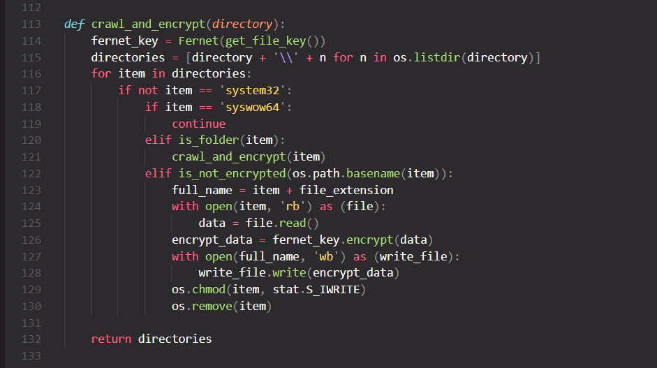
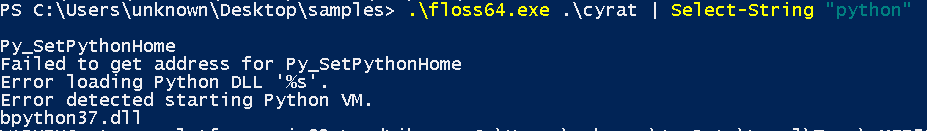
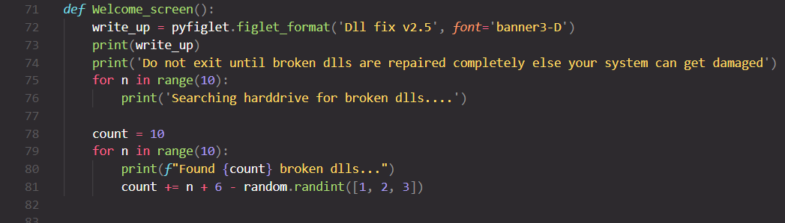
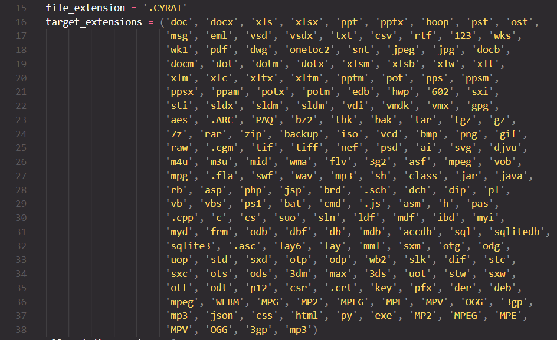
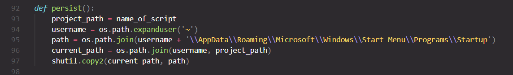

Today I came across the simplest ransomware that I've ever seen, and it's badly written too... So why not make it the subject of the 1st blog?

## Initial Analysis
The binary's size is 12 MB... kinda hard to distribute :)

Running [FLOSS](https://github.com/fireeye/flare-floss) (Strings) reveales why the binary is 12 MB in size:

The binary is written in Python, then the .pyc and library files are bundled into a stand-alone executable using py2exe or pyinstaller (too lazy for C++ huh?)

Time to extract and "uncompyle" the binary back to the original .py files. This requires [pyinstxtractor](https://github.com/extremecoders-re/pyinstxtractor),
python 3.7, and [uncompyle6](https://pypi.org/project/uncompyle6/). The code resides in the file called "Microsoft_dll_fix.py".

## Behavior

Looking at the Welcome_screen function, the ransomware disguises as a "DLL fixer" tool.
It targets files with these extensions:

The crawl_and_encrypt() function is responsible of recursively traversing the E: and F: drives and looking for target files. Once found, a file is encrypted
using fernet (which relies on AES-128 in CBC mode), the fernet key is stored in \Documents\key.txt. Then key.txt is encrypted (encrypt_recognition_key()) using
an RSA key downloaded from mediafire (download_pub()) stored in \Documents\pub_key.pem and the encrypted file is dropped as EMAIL_US.txt. After that, the ransom note is dropped in all allowed
directories: Desktop, Downloads, Pictures, Music, Videos, Documents as RANSOME_NOTE.txt.
After encrypting the files, the ransomware calls destroy_shadow_copy() which attempts to delete VSS backup copies of files.

For persistence, the executable is copied to the startup directory so that it will be launched by Startup on logon/reboot.
The ransomware also uses bcdedit to set recoveryenabled to No and bootstatuspolicy to ignoreallfailures in order to disable Windows automatic startup repair.

## A word about fernet
Fernet buffers the entire ciphertext before writing it to disk to prevent misuse before the data is verified, which will lead to MemoryErrors and thus crashes when attempting to encrypt large files,
that's why fernet, along with other low-level cryptographic primitives that can be easily misused, are in the Hazmat (hazardous materials) layer in pyca/cryptography API.

And that's it... the quickest analysis ever :)

Executable's hash: 4b76ad80e9ce4c503bde0e476a88447426fc38315d440d22926627295e1b0ec6 (SHA-256).