> [GCP Pentest Lab](https://github.com/lacioffi/GCP-pentest-lab) is a vulnerable cloud environemnt designed to learn and exploit clouod misconfigurations and vulnerabilities. We will be jumping around the environemnt using different security flaws to uncover embedded flags left for us.

## Setup

All we have to do is clone the [GCP Pentest Lab Github repo](https://github.com/lacioffi/GCP-pentest-lab).

`git clone https://github.com/lacioffi/GCP-pentest-lab.git`

Authenticate to our GCP account via the terminal and select our project where we will be deoploying the vulnerable environment.

`gcloud auth login`

And finally run the Terraform manifests to deploy the environment and enter your GCP project ID.

`terraform init && terraform apply`

When the deployment is done, terraform will return a public IPv4 address, we can start from there.
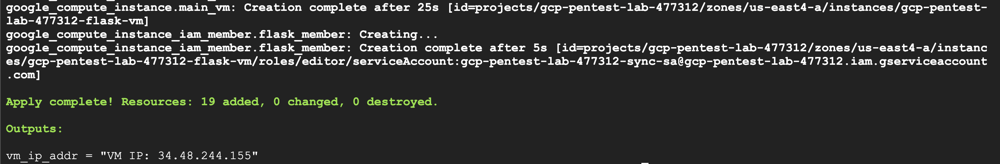

## Flag 1

> Flag 1 is in an open bucket

Let's start by visiting the public IP address usign our browser

Looking at the network tab, we notice that images are being fetched from Google Cloud Storage buckets. The first bucket we see is called **gcp-pentest-lab-477312-prod-bucket** (gcp-pentest-lab-477312 is our project ID), so let's check if this bucket is misconfigured and allows us to list its content:

`https://storage.googleapis.com/storage/v1/b/gcp-pentest-lab-477312-prod-bucket/o`

And we can see that we don't have **.list** permission on this resource. The objects in the buckets are public, but we can't list their names.

Let's keep loooking for public buckets because that's where the flag is. We see another public bucket being accessed: **gcp-pentest-lab-477312-dev-bucket**

`https://storage.googleapis.com/storage/v1/b/gcp-pentest-lab-477312-dev-bucket/o`

And as we can see, we have the **.list** permission on this public bucket.

Looking through the files in that bucket we can find a file called **flag1.txt**. 

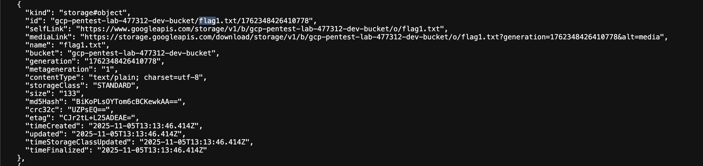

We download that file using the **mediaLink**, and that's our first flag!

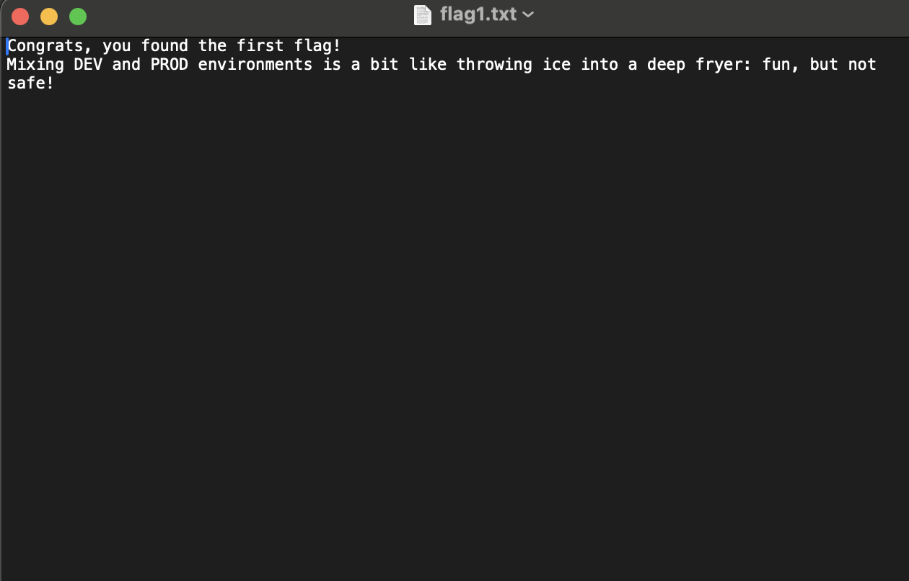

## Flag 2

> Flag 2 is in another bucket, but this one isn’t public 🙂

Looking at the files in **gcp-pentest-lab-477312-dev-bucket**, we see an interesting file name: **sync_sa_key.json**

After downloading that file, we notice that it contains a base64 string, let's decode that.

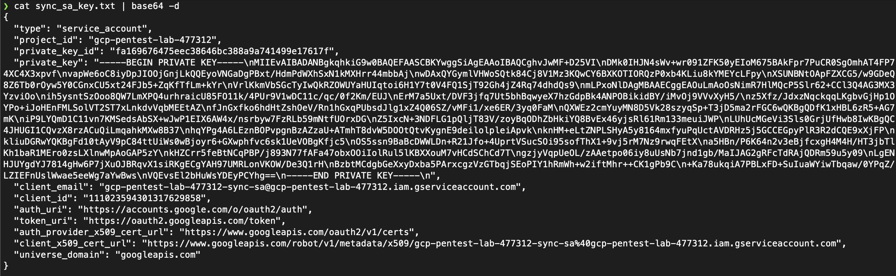

As we can see, that's a service account private key which we can use to impersonate and gain the privileges of that service account.

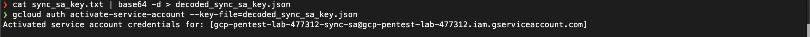

Great, so now we are authenticated as that service account. Let's use our access to list all the buckets. Flag 2 is in a private bucket, remember? We can list all buckets using `gsutil` or `gcloud storage ls`.

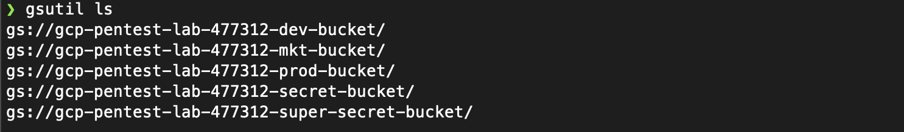

We can see the prod and dev buckets from earlier, but flag 2 is not in any of them. After listing the objects in **gcp-pentest-lab-477312-secret-bucket**, we can see **flag2.txt**, we can use `gcloud storage cp ...` to download it. And that's our second flag.

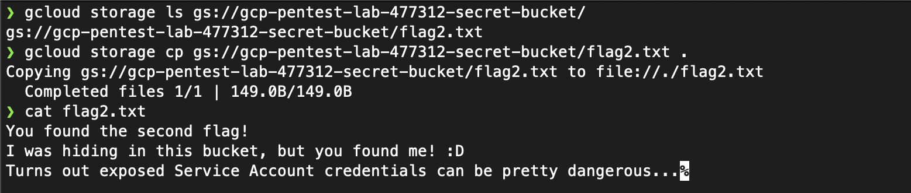

## Flag 3

> Flag 3 is sitting inside some source code

Since we were able to access the web application using a public IP, it's mostly likely being hosted on a compute engine VM. Using our service account, we list compute engine VM instances that are running and we see that an instance ending with **flask-vm** is running. There are multiple ways to gain access to that VM instance from here, but the easiest would be to add our public SSH key into the instance's metadata. This allows us to use our private key to SSH into the VM instance and take things from there.

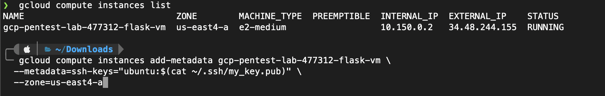

Now we can simply SSH into the VM instance using `ssh -i <private-key> <username>@<external_ip_address>`

We dig around for a bit and we easily find the file **/etc/gcp-pentest-flask-app/app.py** and that's where our 3rd flag is located.

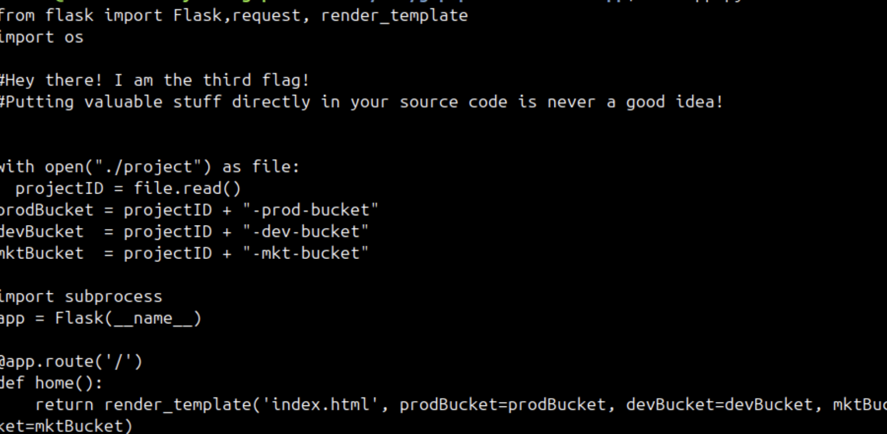

**That's why we should be VERY careful when handling service account private keys and access tokens in a cloud environment. A simple leak can lead to devastating effects especially when least privilege principle is not being followed.**

## Flag 4

> Flag 4 is a secret, literally!

The first thing that comes to mind when I see the word **secret** is GCP's Secret Manager which is a secrets and credential management service that lets you store and manage sensitive data such as API keys, usernames, passwords... 

Unfortunately our service account that we impresonated earlier doesn't have the necessary permissions to access Secret Manager. So let's try to do that using the VM's default service account. We can fetch the default service account's access token from the VM's metadata and impersonate that service account to make requests to the Secret Manager API.

Let's start by using the access that we gained to the flask-vm instance to fetch the default service account's access token

`curl -H 'Metadata-Flavor: Google' http://metadata.google.internal/computeMetadata/v1/instance/service-accounts/default/token`

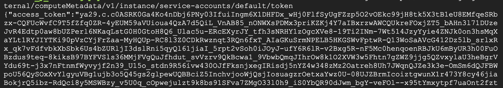

We can store that access token in a env var for easy access

`export ACCESS_TOKEN_DEFAULT=<token>`

Now let's use the default service account's token to send fetch secrets using the Secret Manager API

`curl -H "Authorization: Bearer $ACCESS_TOKEN_DEFAULT" "https://secretmanager.googleapis.com/v1/projects/gcp-pentest-lab-477312/secrets"`

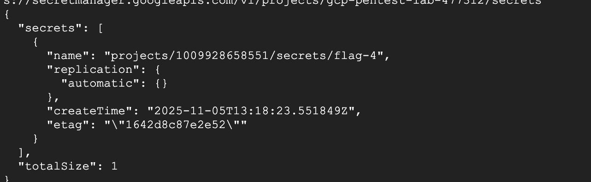

And as we can see there is a secret called **flag-4**. Let's try to access it. Notice that a secert in Secret Manager can have multiple versions, we use **latest** to get the most recent version.

`curl "https://secretmanager.googleapis.com/v1/projects/gcp-pentest-lab-477312/secrets/flag-4/versions/latest:access"  --header "Authorization: Bearer $ACCESS_TOKEN_DEFAULT"`

And we can see that flag-4 contains a base64 encoded string.

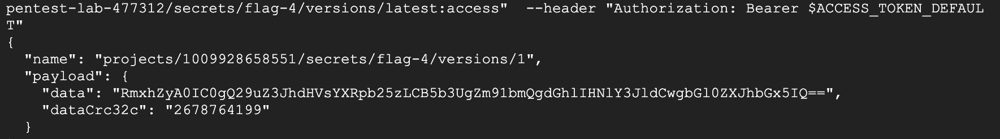

So let's decode it and get our 4th flag.

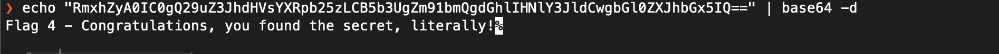

## Flag 5

> Flag 5 is inside some instance but isn’t a file!

So the flag isn't stored on the VM's disk and it's not an env var. Let's take a look at the instance's metadata key-value pairs. 

We can list compute engine instances again using `gcloud compute instances list`.

We can use the same service account from earlier (the one we got access to by fetching its private key from the dev bucket). Since we activated that service account earlier, we can easily fetch its accesss token, store it in an env var, and use it to fetch the instance's metadata using the Compute Engine API.

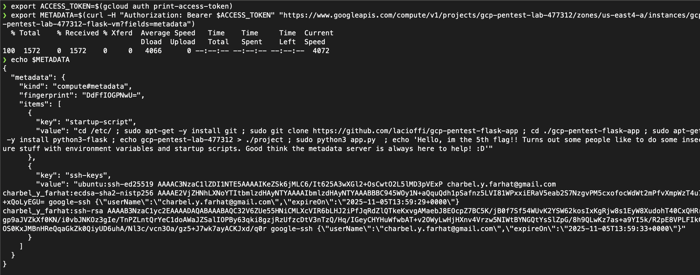

There we go, the 5th flag is stored in the instance's startup script which is in this case embedded direclty into the instance's metadata. Embedding a script directly into the instance's metadata is not best practice, it's much better to store the startup and shutdown scripts in a Google Cloud Storage bucket and storing their URLs in the instance's metadata.

## Flag 6

> Flag 6 is in yet another bucket, but this one is the most restricted yet!

Earlier we saw a bucket with a name ending with **super-secret-bucket**. Going back to the instance's default service account, we can use its token (just like we did earlier) to list the objects inside that bucket.

`gcloud storage ls gs://gcp-pentest-lab-477312-super-secret-bucket`

We can see a file called  **flag6.txt**. And we can download that file using the Google Cloud Storage API

`curl -H "Authorization: Bearer $ACCESS_TOKEN_DEFAULT" "https://storage.googleapis.com/storage/v1/b/gcp-pentest-lab-477312-super-secret-bucket/o/flag6.txt?alt=media"`

And we have out 6th and final flag.

## Final Thoughts

This lab demonstrates how dangerous it is not to follow least privilege principle, mishandling service account private keys and access tokens, and misconfiguring Google Cloud Storage (and S3) buckets.