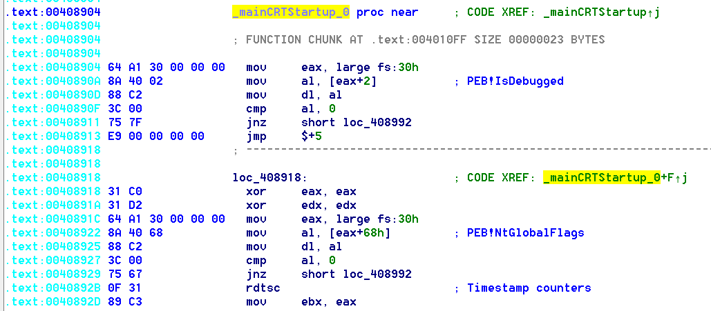
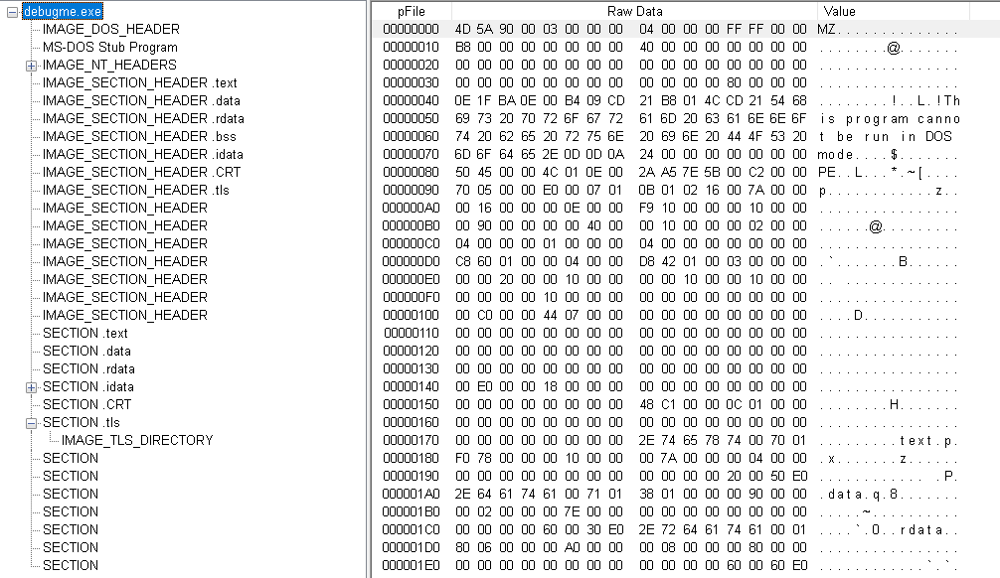
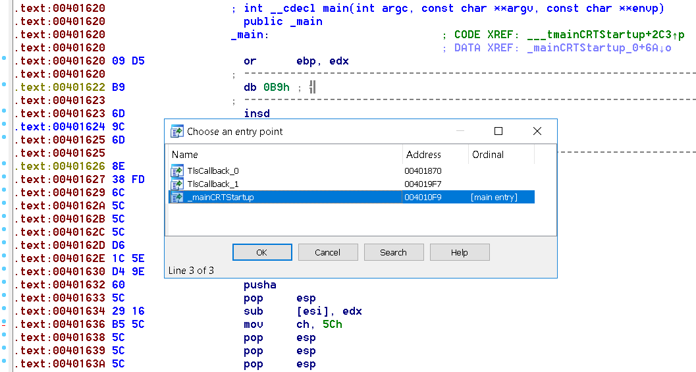
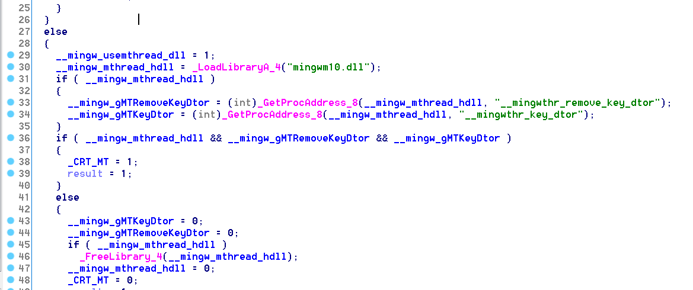
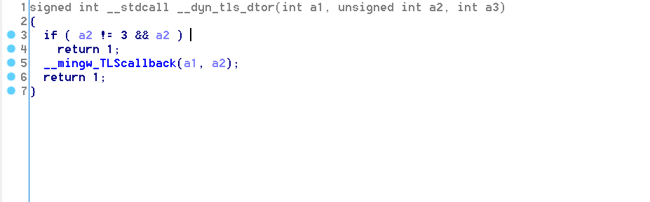
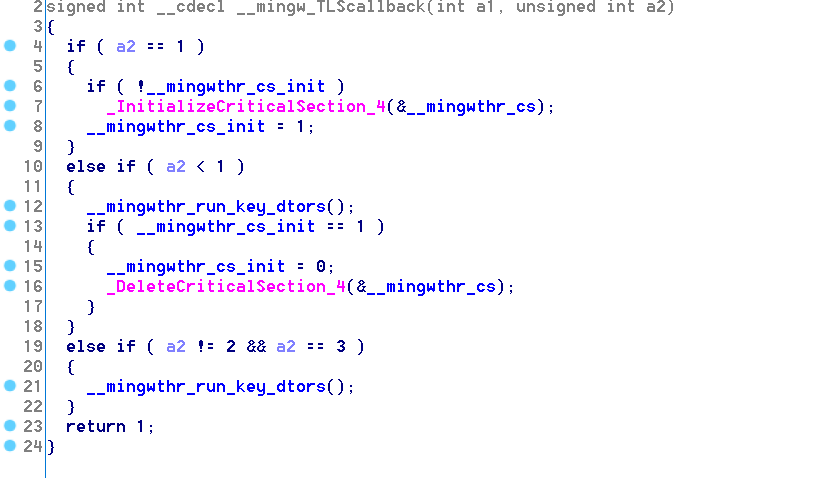
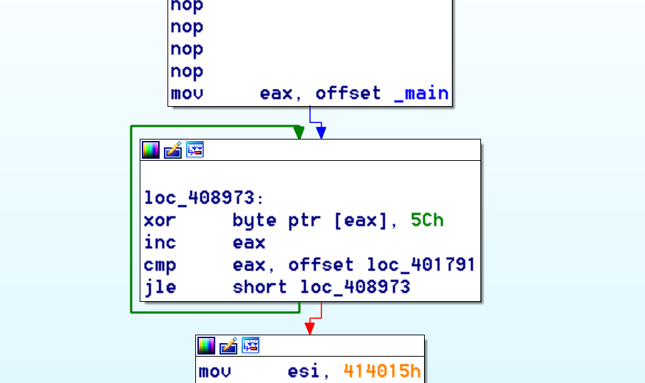
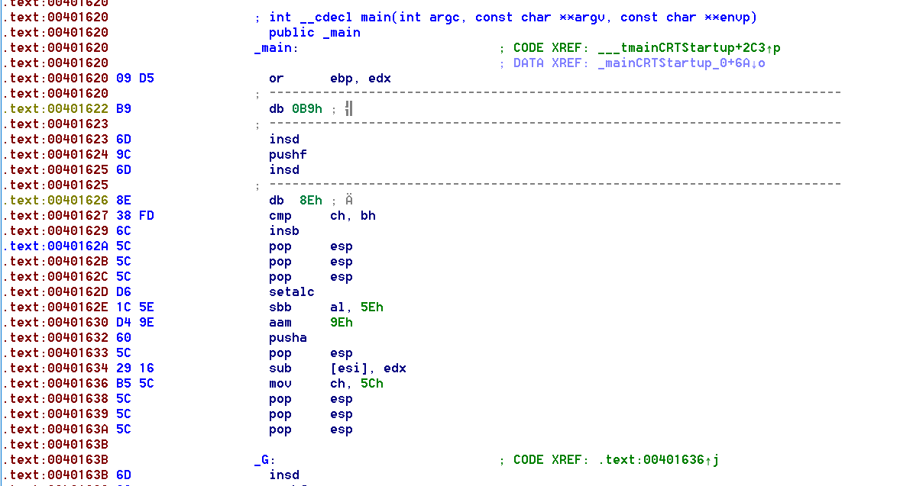
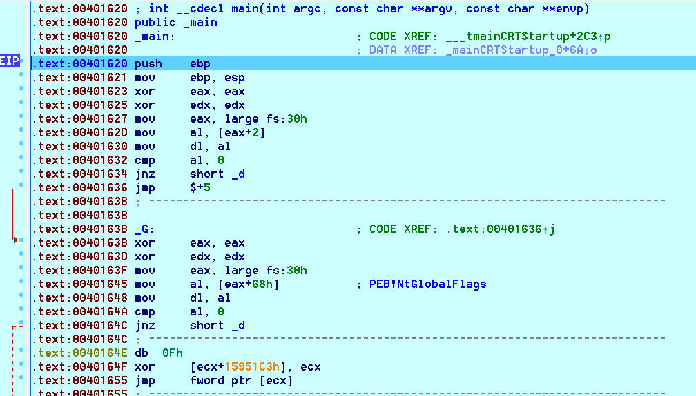
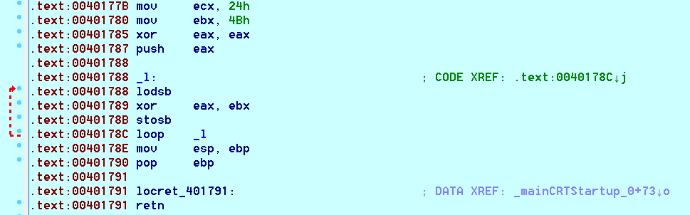

> Description:
> A develper is experiementing with different ways to protect their software. They have sent in a windows binary that is supposed to be super secure and really hard to debug. Debug and see if you can find the flag.

## Initial Analysis

The binary is a 32-bit EXE compiled with MinGW.

Lets take a look at the EXE's sections. I'm using the classic PEview but you can use any other tool ([CFF Explorer](https://ntcore.com/?page_id=388) is good).



The usual EXE sections are present (.text, .data, .rdata, .bss, .idata) and .tls which might be interresting, we'll see...

Running FLOSS on the binary doesn't return anything useful. Now its time to dive in...

## A Word About TLS Callbacks

TLS (thread local storage) callbacks are a mechanism provided by the Windows loader to give your program a chance to do initialization/deinitialization tasks when the process starts/terminates. TLS callbacks execute before any other code in the executable, so they are a good place to hide code.
Malware authors use them sometimes to execute malicious code before the debugger has a chance to pause at the traditional Entry Point, one of the oldest anti-debugging tricks is using TLS callbacks to check for the presence of a debugger.

## Static And Dynamic Analysis

I personally like to start with static analysis until I get stuck on something that requires a debugger.
Let's load our binary in IDA and take a look...
We'll check the TLS callbacks first, we are looking for anything that can hinder the debugging of the executable (anti-debugging tricks).
To locate the TLS callbacks init (ctor) and dtor in IDA you can press ctrl+E.



Here is the pseudocode of **TlsCallback_0** (init)



And here is the pseudocode of **TlsCallback_1** (dtor)



we only notice **__mingw_TLScallback** being called, and here is its pseudocode



Nothing interresting in all 3 TLS functions...
Now we can safely move on to **_mainCRTStartup** which is the entry point of the executable.
At address **0x00408904**, based on the control flow graph we see what looks like 3 checks being made, if one fo the checks fails the function returns.
Here is the code of the first check being made:
```nasm
mov     eax, large fs:30h
mov     al, [eax+2]     ; PEB->BeingDebugged
mov     dl, al
cmp     al, 0
jnz     short loc_408992
```
This is one of the oldest windows anti-debugging trick in the book.
This code is loading the address of the Process Environment Block (PEB), via the Thread Information Block, which can be accessed via the FS segment, into eax. The PEB contains, amongst other things, a flag indicating if the process is being debugged (BeingDebugged flag), found at offset 0x2 in the PEB. BeingDebugged is set by the system when the process is debugged. Then the code checks if the flag is set, if it is, it jumps to **loc_408992** and thus ending execution, if not, it continues to the second check.

The second check being made:
```nasm
xor     eax, eax
xor     edx, edx
mov     eax, large fs:30h
mov     al, [eax+68h]   ; PEB->NtGlobalFlag
mov     dl, al
cmp     al, 0
jnz     short loc_408992
```
Another field in the PEB is being checked, this time the NtGlobalFlag field located at offset 0x68 in the PEB and initialized by the kernel.
When a process is created, the system sets some flags that will define how various APIs will behave for this program. Different flags are set based on the process being created under a debugger or not. If the process is being debugged, some flags controlling the heap manipulation routines in ntdll will be set, such as: FLG_HEAP_ENABLE_TAIL_CHECK, FLG_HEAP_ENABLE_FREE_CHECK and FLG_HEAP_VALIDATE_PARAMETERS. So in short, this value changes when a debugger is present and thus it can be checked to detect the presence of a debugger.

The 3rd and final check:
```nasm
rdtsc                   ; Timestamp counters
mov     ebx, eax        ; store value of TSC in ebx
push    ecx
pop     ecx
add     edi, edi
sub     edi, edi
push    esi
pop     esi
add     ecx, ecx
sub     ecx, ecx
push    esi
pop     esi
add     edi, edi
sub     edi, edi
push    ecx
pop     ecx
add     ecx, ecx
sub     ecx, ecx
add     edi, edi
sub     edi, edi
push    esi
pop     esi
rdtsc
sub     eax, ebx        ; calculate delta (sub new_TSC, old_TSC)
cmp     eax, 3E8h       ; return if delta > 0x3E8
jg      short loc_408992
```
This is another classic anti-debugging trick...
We only care about the first two and last four instructions in this block. this code is using the timestamp counter to determine if the process is being debugged or not. The RDTSC instruction queries the TSC (timestamp counter) which stores the number of cycles since reset.
The trick here consist of measuring time delta (difference between 2 values of the TSC) between 2 different points during program execution, if the delta is higher than a specified value (0x3E8 in this case) we can conclude that the process might be running in a debugger, and this is exactly what we see here: 2 RDTSC instructions and the difference (delta) between 2 values of the TSC is being calculated.
We usually see the 2 RDTSC instructions around exception handlers since processing the exception in the debugger and returning control back to the debuggee is a lengthy task (requires more time and more CPU cycles) and thus increasing delta.

These 3 anti-debugging tricks can be bypassed using different techniques. The quickest way is to simply patch the binary to avoid these checks. some debuggers (like ollydbg) have anti-debug plugins that will help you bypass these and other checks.

Moving on... after passing the 3 checks, we find this:



Here we see a single-byte XOR decryption loop that's XORing the opcodes of the main function by 0x5C.

Let's see what main looks like before decryption:



These are the bytes that will be decrypted by the XOR loop to generate the actual code of the main function.

So now we throw the executable in a debugger and let the XOR loop run, then we'll and see what main looks like after decryption.



And this is what main looks like after decryption. lookiing at the code, we see the same 3 anti-debugging tricks used here again... a quick manual way to bypass them here is setting the Zero flag after executing the cmp instruction in each check to avoid taking the jump, and thus even if the check fails (a debugger is detected) the execution will continue normally.

Looking at the end of main we see this:



Another XOR loop... this time only 0x24 iterations (ECX is the counter), on each iteration it XORs a byte, loaded from the memory location which address is stored in EDI, with 0x4B, and then it stores that byte in the location pointed to by the address in EDI. The LOOP instruction decrements ECX.
If you haven't guessed it already this loop is decrypting the flag.