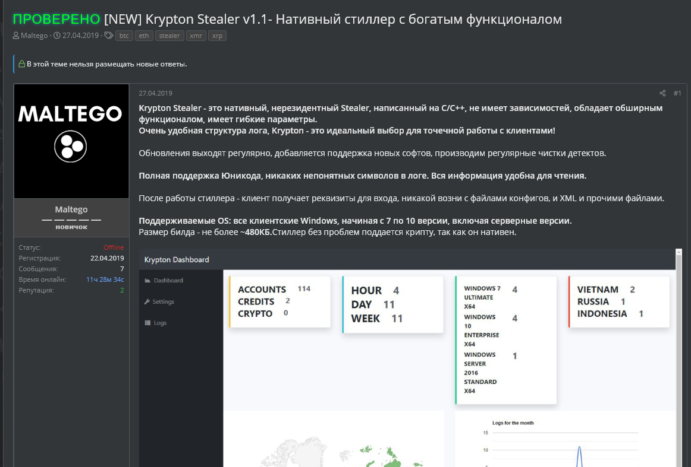

Krypton stealer first appeared on the scene last year on darkweb.cc and it was going for around $100. It's an efficient, small sized, credential stealer
targeting Windows users.
The version of krypton stealer analysed here (one of the early versions) is very light and can be easily integrated into a more sofisticated attack since it's compact and can be easily dropped
at any stage.

This version of Krypton doesn't employ any anti-RE or anti-VM techniques, not even string obfuscation, so I ran through it and was able to analyze most of
the IDB in no time (yes, it was a bit boring lol).

Whenever I'm analyzing malware I'd like to try and get an understanding of the author's skills based on the code written, for this one I'd say the author is definetly not
a beginner, for instance, he avoided the urge of using the strings C++ lib even though stealers work with a lot of text data which could've saved him a lot of time and effort but instead he used regular C char arrays
and thus kept the size of the executable small....

Some of the targeted software:
Browsers: Google Chrome, Edge, Interned Explorer, Firefox, Chromium, Opera, Amigo, Torch, Orbitum, Kometa, Comodo Dragon, Nichrome, Maxthon5, Sputnik, Epic Privacy Browser, Vivaldi, CocCoc...
FTP Clients: FileZilla, TotalCommander, FTPNavigator, WinSCP.
VPNs: ProtonVPN, NordVPN.
Crypto wallets: Exodus, Etherum, Electrum, Jaax…
Telegram, Pidgin,...
Windows vault credentials...

Dynamic Analysis of the sample: [AnyRun krypton analysis](https://app.any.run/tasks/bb3862fe-7708-4226-befc-de870efa787f/)
Hash of the executable: a84f1fe984e6fb04af0e029b67245f2167bcec766959f5033bfbf5ac00f0d396
C&C server: f0304768[.]xsph[.]ru

And here's a link to the analyzed IDB on my github: [Krypton_stealer.zip](https://github.com/dwbruijn/dwbruijn.github.io/assets/blog_files/IDBs/Krypton_stealer.zip)