# Introduction

>OWASP Juice Shop is probably the most modern and sophisticated insecure web application! It can be used in security trainings, awareness demos, CTFs and as a guinea pig for security tools! Juice Shop encompasses vulnerabilities from the entire OWASP Top Ten along with many other security flaws found in real-world applications!

More details can be found [here](https://github.com/juice-shop/juice-shop)

# Level 2 Challenges
## Access the administration section of the store

The first logical step is to check the source files in developer tools for paths that contain the word **admin**. JS files
are a good place to look for endpoints, this is common practice when building the web app's attack surface.

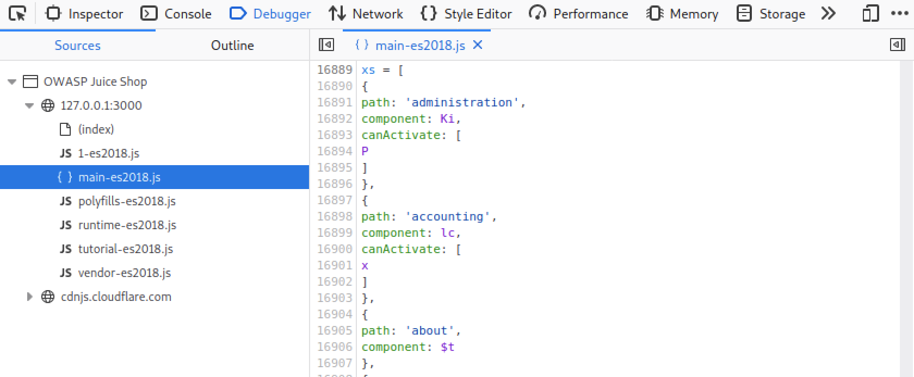

Inside **main-es2018.js**, by searching for the word **admin**, we found the endpoint **/administration** which is what we
were looking for.
Note: You can use tools to extract endrpoints, links, and other interresting stuff from JS files. More details [here](https://pravinponnusamy.medium.com/find-the-treasure-hidden-in-javascript-546827e1a4e2).

When we navigate to **/administration** we get hit by a 403 forbidden which indicates that we need admin-level access. One might
notice that the when visiting the **/administration** page no request gets sent to the server, that's because the checking is taking place
on the client's end using Angular's route guard, whcih is obviously not secure, but we won't go there in this challenge.
So, now let's figure out how to get admin-level access (which happens to be a seperate challenge).

## Log in with the administrator's user account

There are multiple ways to solve this challenge, I solved it using SQL injection.
First we navigate to **/login** and we try the simple SQL injection test.

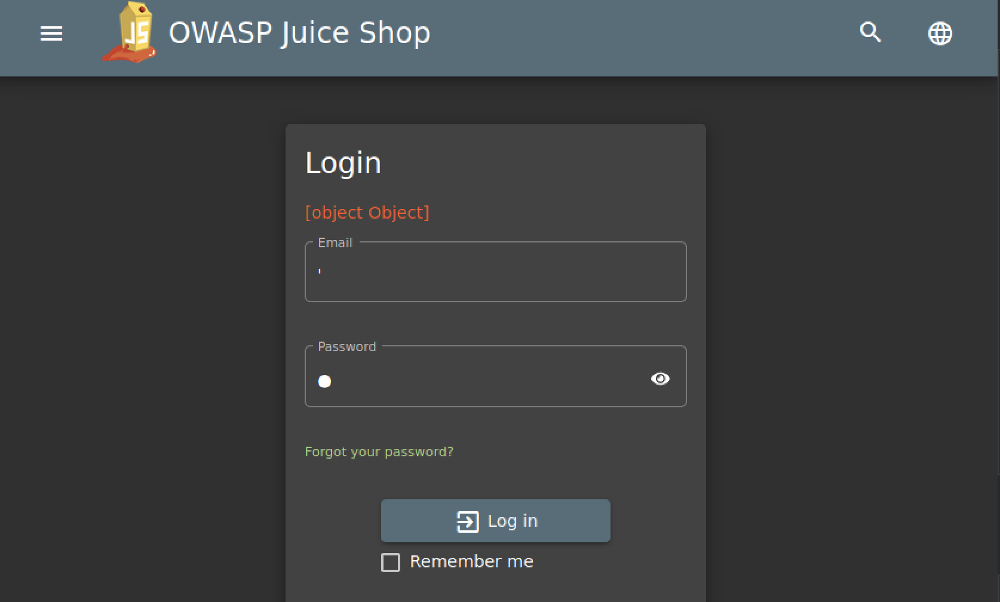

We receive some kind of a error which is a good sign. Let's see what Burp Suite Professional scanner makes of this.

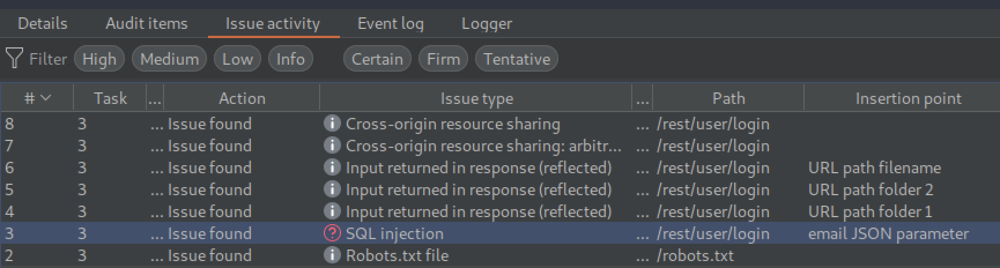

Using tests similar to the one we performed, Burp was able to determine that the **rest/user/login** API endpoint is vulnerable to SQL injection.
Now Let's try to exploit this, assuming that the query executing on the backend whenever a login attempt happens looks something like this:
```sql
SELECT ... FROM users WHERE email = '<input>' and password = '<hashed input>';
```
We can try another simple payload: **' or 1=1--**. Thus the query becomes:
```sql
SELECT ... FROM users WHERE email = '' or 1=1--' and password = '...';
```
Note that -- is the comment symbol in SQL, so the SQL statement that will execute is:
```sql
SELECT ... FROM users WHERE email = '' or 1=1;
```
This will give us access to the **admin** account which happens to be the first entry in the users table, thus solving this challenge.

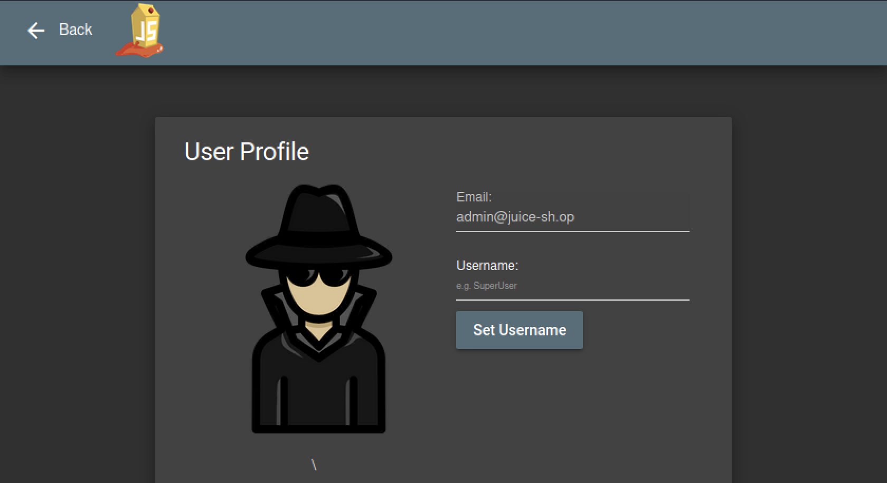

Now we can access **/administration** since we have admin-level access, thus solving the previous challenge.

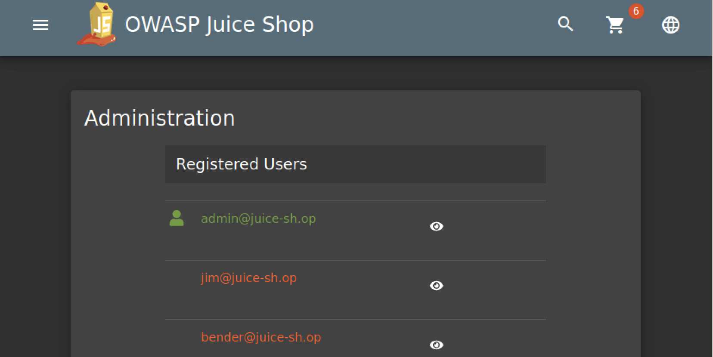

## View another user's shopping basket

We are looking to exploit an **IDOR** in this challenge, so let's go.
After creating a account on Juice Shop, we can access our shopping basket through **/basket**. So let's do that and let's intercept the request with Burp proxy.

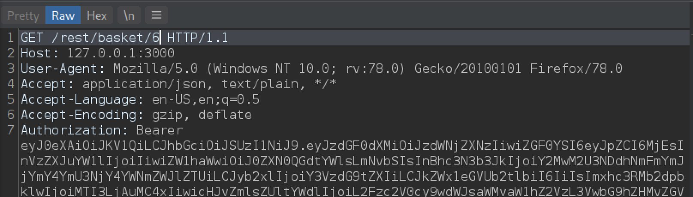

We can see that the format is **rest/basket/BasketId**, our BasketId is 6, let's try decreasing it by 1 to see if we can access basket 5 which belongs to another user.

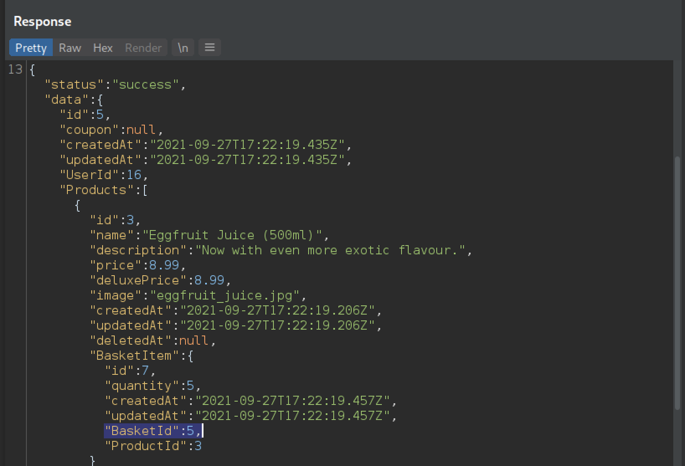

The server responds with status code **200** and the contents of basket 5 which belongs to the user with UserId = 16.

# Level 3 Challenges
## Post some feedback in another users name

From **/contact** a user can submit his feedback which will be displayed on **/administration**. After navigating to **/contact**, submitting a feedback, and intercepting the request with Burp proxy we get the following:

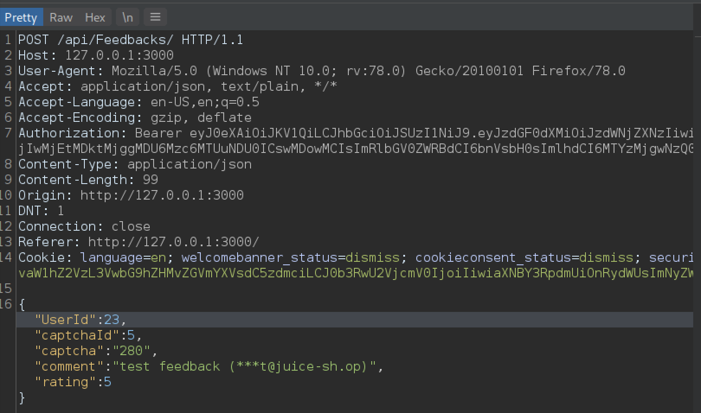

We can see that our **UserId** is 23 (which is a hidden field), but does the application perform the necessary checks to detect if a user tries to impersonate another user and submitted a feedback using that user's id? Well let's try changing the **UserId** to 20 and let's see what happens.

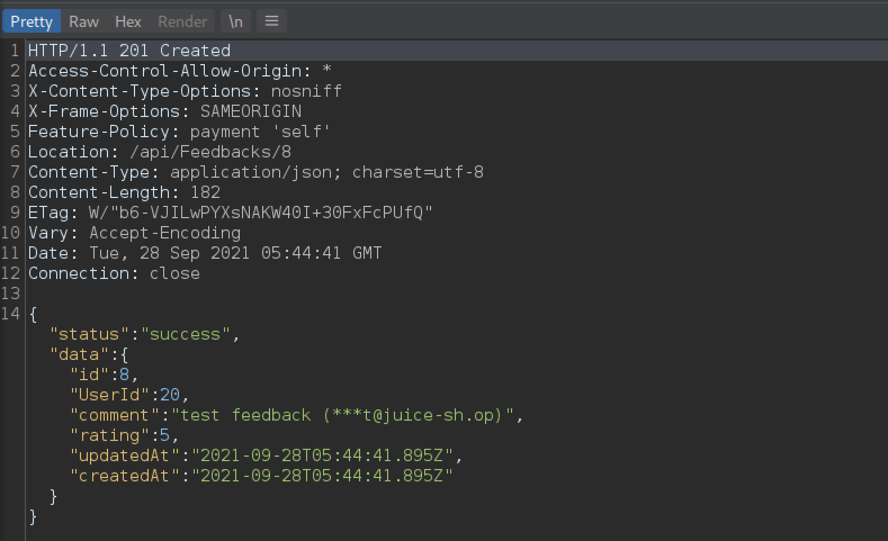

The server responds with status code 201 created, and we can see in the returned JSON that the **UserId** was in fact changed to 20 for that feedback.
On the **/administration** page we can see our feedback submitted under **UserId** 20.

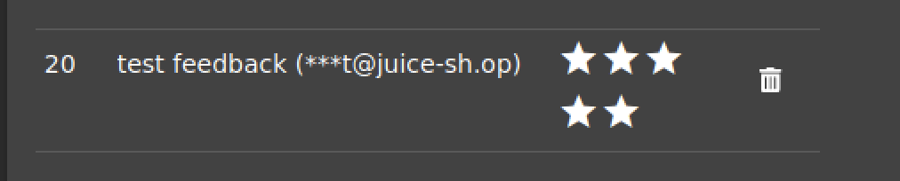

So the application fails to perform necessary checks to verify that the user submitting the feedback (current session) is who he claims to be (value of the UserId hidden field).

## Post a product review as another user

A user can submit reviews for each product in the juice shop. Whenever we click on a product, a request is sent to fetch the reviews submitted under this product. So let's intercept that request for product 1 with Burp proxy.

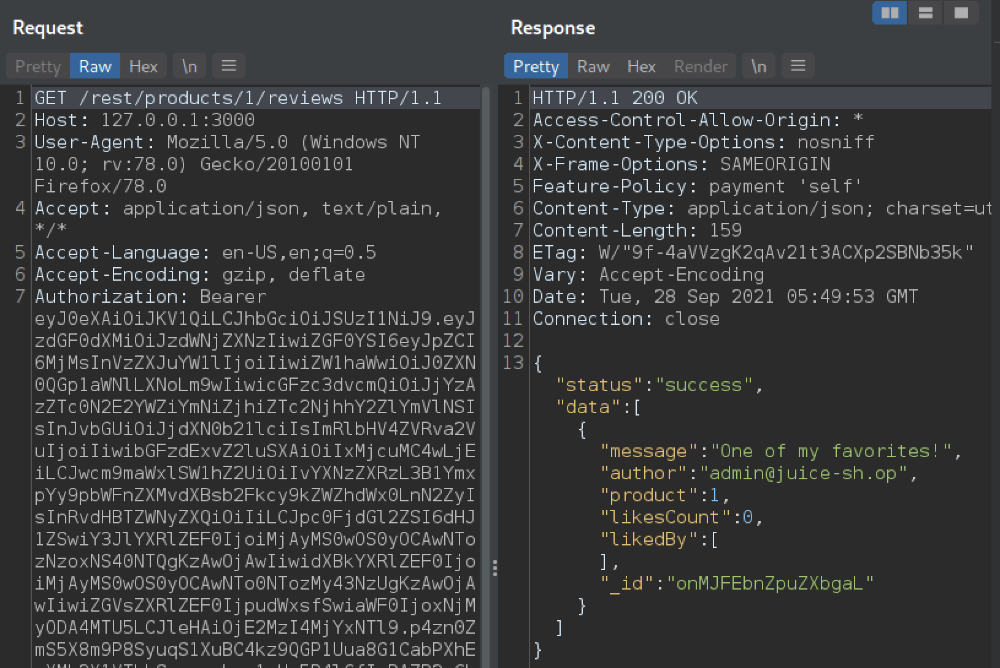

We can see in the response that only 1 review exists for product 1, it was submitted by the admin. Now let's try to submit a new review, and impersonate admin as well.

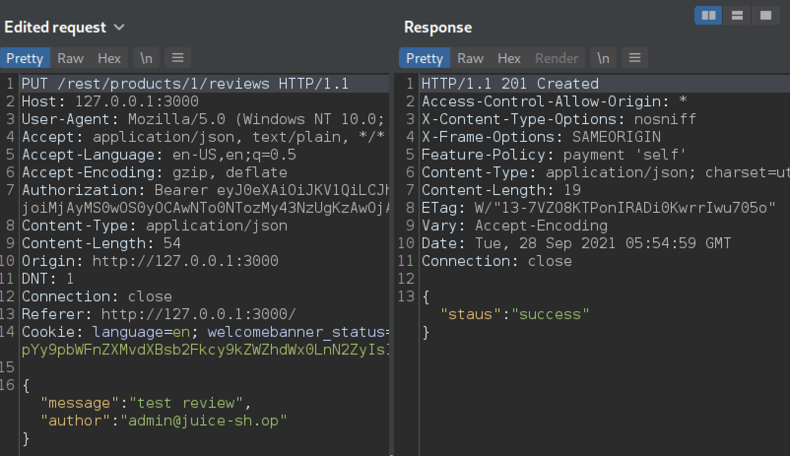

This is the edited PUT request in Burp proxy, we changed our email to **admin@juice-sh.op** to impersonate the admin. The server responded with status code 201 created, and we can see the new review under product 1.

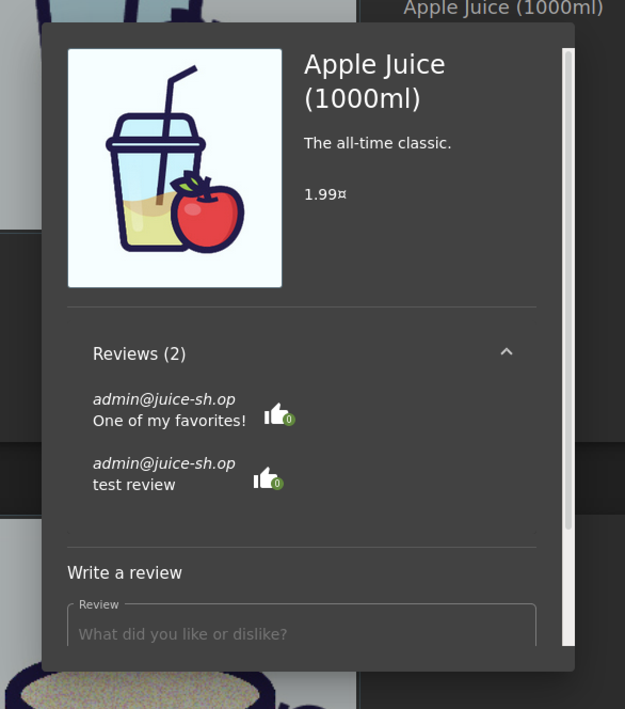

## Put an additional product into another user's shopping basket

Well that sounds easy, let's add a product to our basket and then change **BaskedId** in the request to another user's **BasketId**. That should work if the server fails to check if the submitted **BasketId** belongs to us or not.

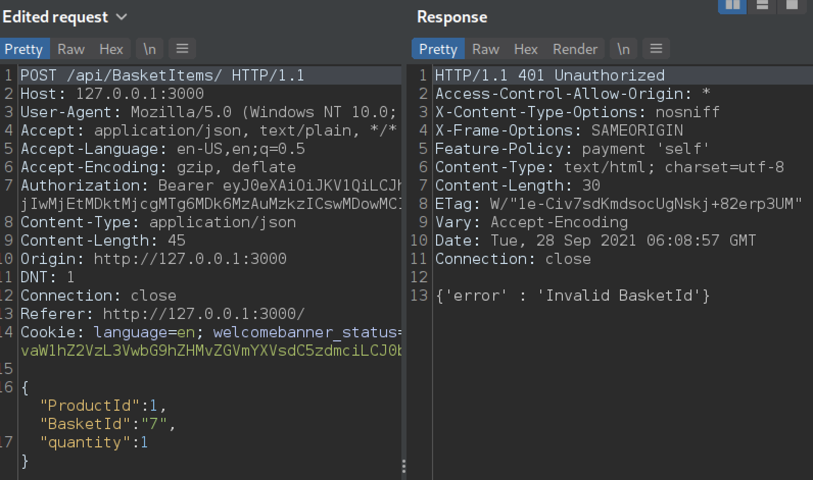

Remember, our **BaskedId** is 6, we changed it to 7 in the request, the server responded with status code 401 unauthorized and a message: "Invalid BasketId". Ah, so the server is performing some kind of checking on the **BasketId**, now the question becomes: is the server performing the checking in the right way? or can we find some way to bypass this check in order to trick the server?
A common thing to do in this case, is to duplicate the **BasketId** parameter and perform what's known as HTTP Parameter Pollution (HPP),

>Supplying multiple HTTP parameters with the same name may cause an application to interpret values in unanticipated ways. By exploiting these effects, an attacker may be able to bypass input validation, trigger application errors or modify internal variables values. As HTTP Parameter Pollution (in short HPP) affects a building block of all web technologies, server and client side attacks exist.

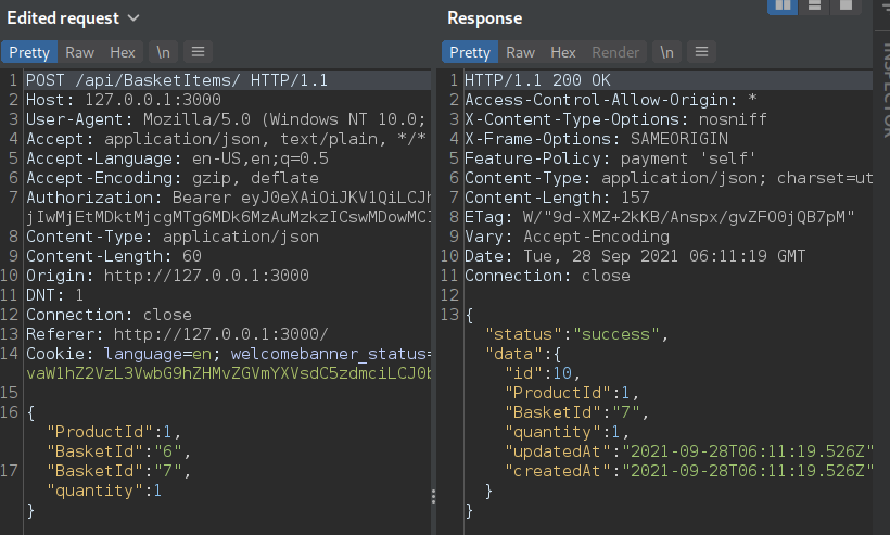

Here we kept our **BasketId** in the first instance and added another instance with value 7. The server responded with status code 200, and we can see in the JSON data returned from the server that the product was added to **BasketId** 7, thus we succeded in bypassing the checks and tricked the server into adding the product into another user's basekt.
The server is using the value of the first instance of **BasketId** when performing the checks, but it's using the value of the last instance when adding the product to the basket.

## Change the name of a user by performing CSRF from another origin

First, I created an account with username **test**. Here we can see the **/profile** page.

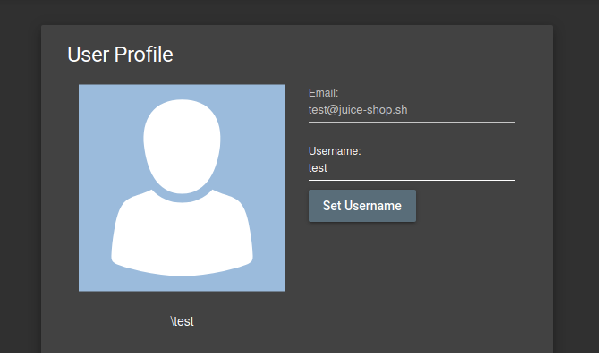

To perform the CSRF attack we have to use a different domain from which we can send a POST request to the **/profile** page in order to modify the username, and since the Juice Shop website doesn't provide any protection against CSRF, this attack will be successful.
To send a request you can use any online real-time HTML and JS editor, and make sure it supports HTTP (no TLS) to avoid any conflicts with the mixed-content policy in the browser since the Juice Shop website uses HTTP. I used [this](http://htmledit.squarefree.com) along with the following request:
```HTML
<form action="http://localhost:3000/profile" method="POST">
  <input name="username" value="new_username"/>
  <input type="submit"/>
</form>
<script>document.forms[0].submit();</script>
```
The request will be submitted automatically, and you will receive a error in the lower frame of the real-time HTML editor, that's totaly expected because the HTML editor is not allowed to embed responses from a different origin.
We can see now that the change is reflected in our **/profile** page, and thus the attack was successful.

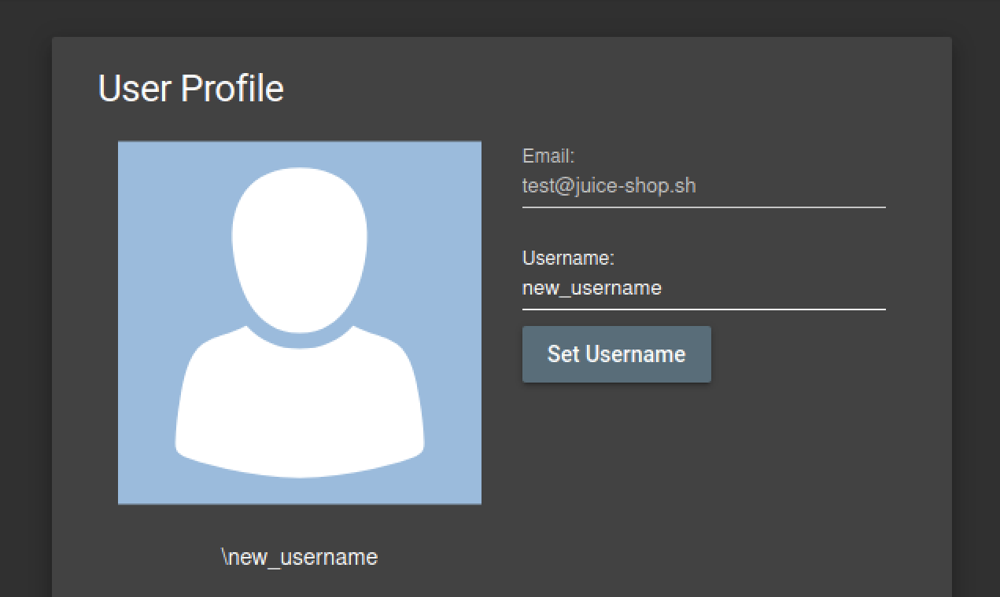

## Change the href of the link within the O-Saft product description

The first thing that comes to mind is simply sending a PUT request to the **products** API endpoint and hoping that there is no access control checks. So first I started by querying the **search** API endpoint in order to find the product ID of the O-Salt product.
I used Postman to submit the GET request, you can use your favorite API testing tool for this. The **search** API endpoint is **http://localhost:3000/rest/products/search?q=<product_name>** and the **product** API endpoint is **http://localhost:3000/api/Products/<product_id>**.

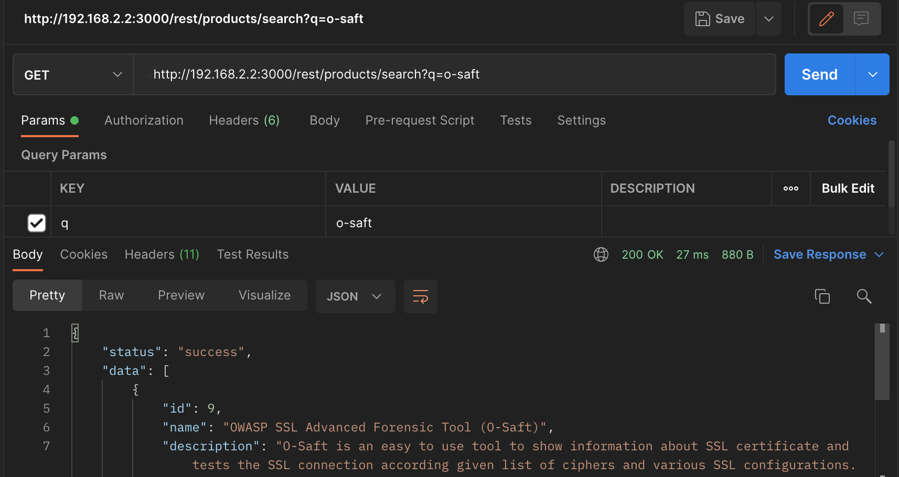

Then I submitted a PUT request to update/modify the product with product ID 9 (O-Salt) and in the request body I placed a JSON payload which contains the new description which will be reflected to the user when he checks the O-Salt product in the shop. Make sure to set the **Content-Type header** for your request to **application/json** to tell the API that your request contains JSON data.

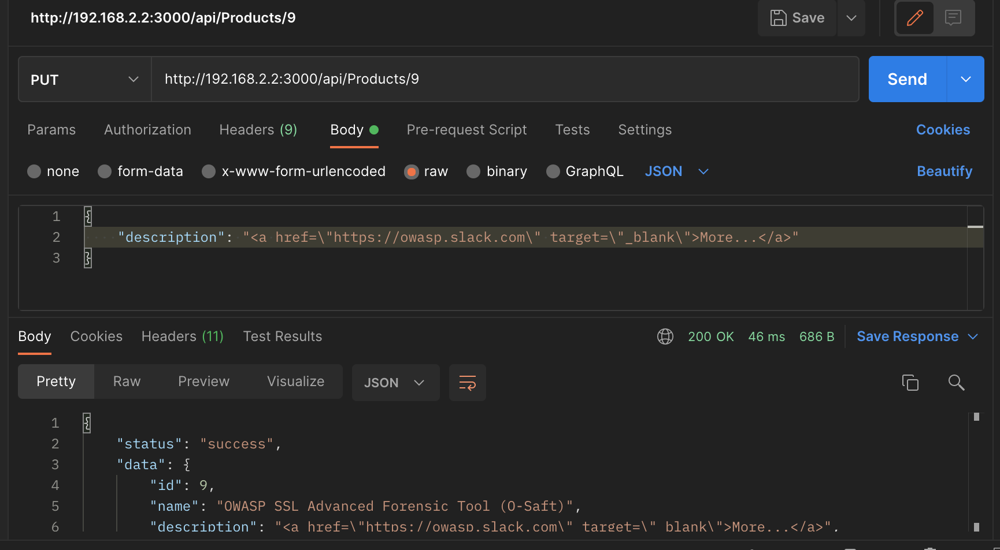

Now if we visit **http://localhost:3000/#/search?q=OWASP%20SSL%20Advanced%20Forensic%20Tool%20(O-Saft)** we can see that the product description has been changed, it only contains a link to **owasp-slack**.

This completes the challenge by successfully modifying the product description through the unprotected API endpoint.