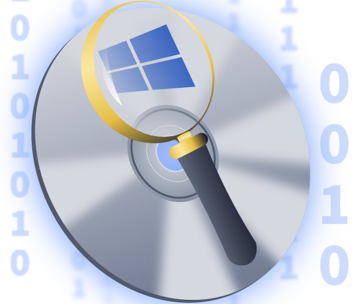

# Introduction

Lately I've been investing a lot of time into TryHackMe's Security Analyst path (SOC L1, SOC L2, Advanced Endpoint Investigations) in order to sharpen my blue teaming skills.

DiskFiltration is a fun challenge that I came across today.

> Description: Tech THM discovered their critical data had been leaked to the competitors. After an internal investigation, the company suspects Liam, a recently terminated employee who was working as a system engineer with Tech THM. This suspicion was raised as Liam had access to the leaked data in his company-provided workstation. He often worked late hours without clear justification for his extended presence. He was also caught roaming around the critical server room and taking pictures of the entry gate. Following these suspicions, Liam’s workstation (provided by the company) was investigated. The initial investigation suggests that an external entity was also helping Liam.

Here's an overview of the attack chain

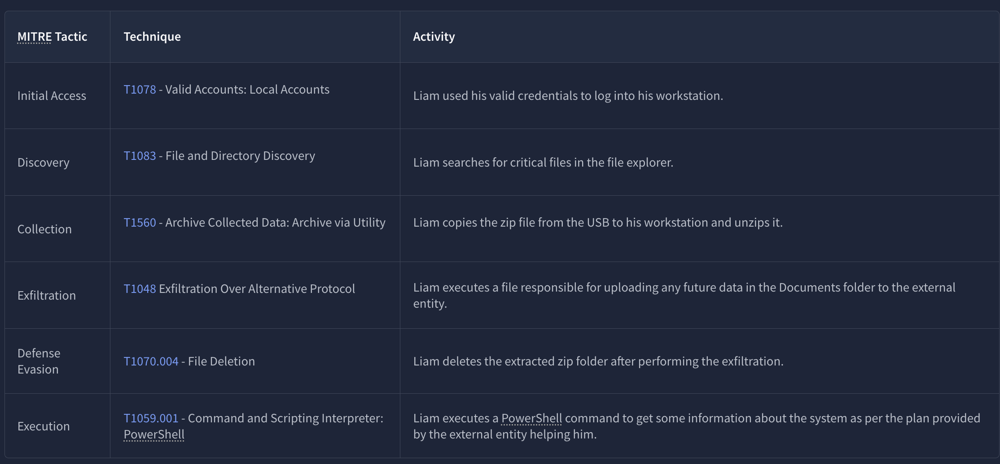

Our task is to find traces of Liam's activities on the live machine using different tools.

# Questions

### What is the serial number of the USB device Liam used for exfiltration? 

Using *Autopsy* to analyze *ds.E01* (Liam's disk) we can examine details of USB devices that were attached to this machine and we can see that the latest USB drive attached has serial number **2651931097993496666**. We could've also done this by accessing extracted hive files using *Registry Explorer* and looking for specific registry keys like `HKLM\SYSTEM\ControlSet001\Enum\USBTOR\` and `HKLM\SYSTEM\MountedDevices??\Volume{...}`

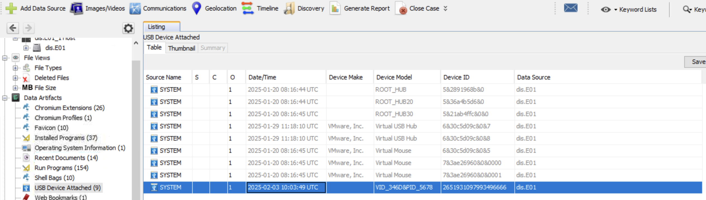

### What is the profile name of the personal hotspot Liam used to evade network-level detection?

The first thing that came to mind was checking `NTUSER.DAT` which is a hidden file in each user's profile folder and it acts as a user-specific registry hive that contains personalized settings and can contain artifacts related to network activity and network names (which is exactly what we're after).

Looking under Recent Documents in *Autopsy* we can see the `NTUSER.DAT` file and an interesting path: `Computer\HKEY_LOCAL_MACHINE\SOFTWARE\Microsoft\Windows NT\CurrentVersion\NetworkList\Profiles\{A1B2C3D4-6043-43B9-CDEF123456789}`

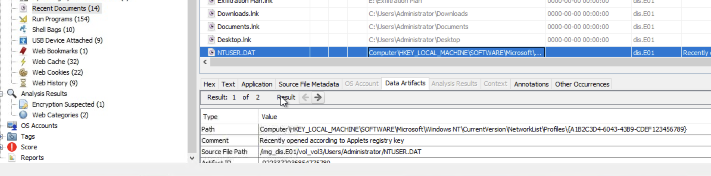

We drill down the file system to locate *Profiles* and we see our *ProfileName*: **Liam's Iphone**.

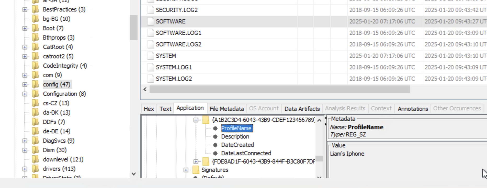

### What is the name of the zip file Liam copied from the USB to the machine for exfiltration instructions?

Based on the attack chain provided above, we know that Liam copied a zip file from his USB drive to his workstation. We can spot the file in Liam's Desktop folder. The zip file is called: **Shadow_Plan.zip**.

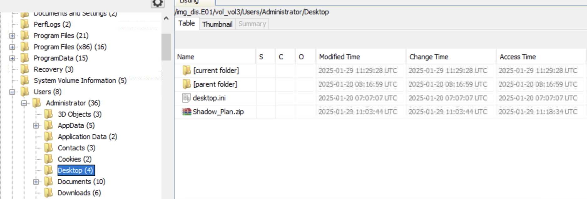

### What is the password for this zip file?

After looking around for a bit, we notice a file called `Pass.txt` in Liam's Documents folder. The password is: **Qwerty@123**

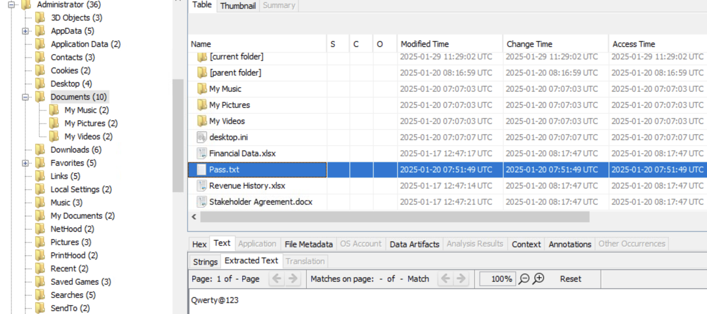

### Time to reveal the external entity helping Liam! Who is the author of the PDF file stored in the zip file?

First we extract the `Shadow_Plan.zip` file using *Autopsy*, we use the password to unzip it, and then we switch from *Autopsy* to *Exiftool* to examine the `breach_plan.pdf` file contained inside. And as we can see, the Author's name is **Henry**.

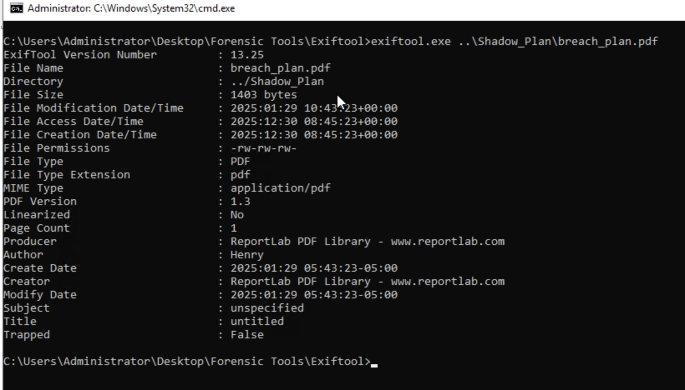

### What is the correct extension of the file that has no extension in the zip folder?

We use *Exiftool* for this one as well and we can see that the file `confidential` is of type `image/png`.

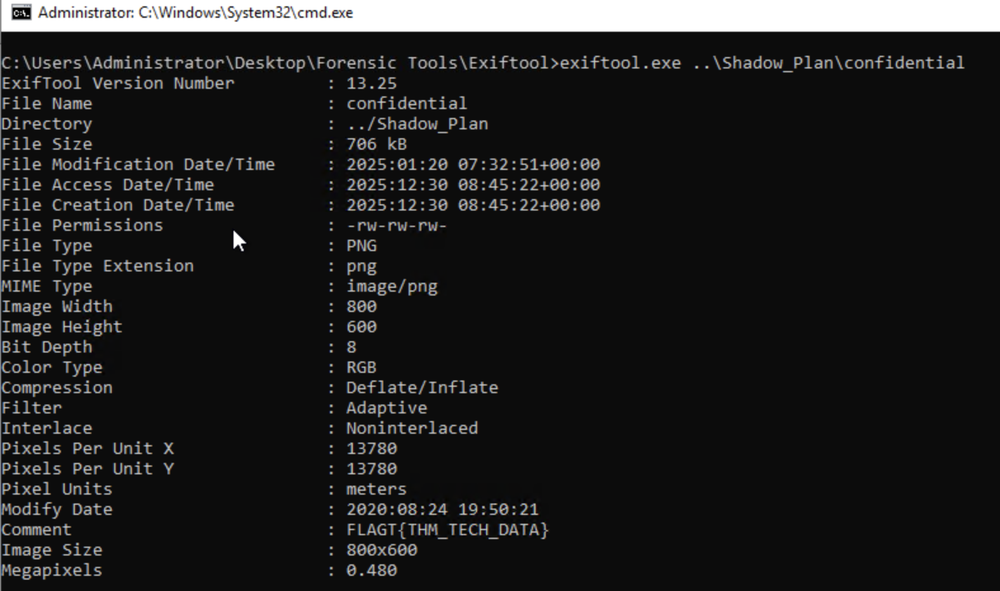

### It looks like Liam searched for some files inside the file explorer. What are the names of these files? (alphabetical order)

We can find traces of *File Explorer*'s search history in the registry. So we look at user-specific registry hives under `NTUSER.DAT` file in Liam's profile directory. The specific keys that store search history are under `\Users\Administrator\NTUSER.DAT\Software\Microsoft\Windows\CurrentVersion\Explorer\WordWheelQuery`. Looking at the values we can see keywords **Financial** and **Revenue**.

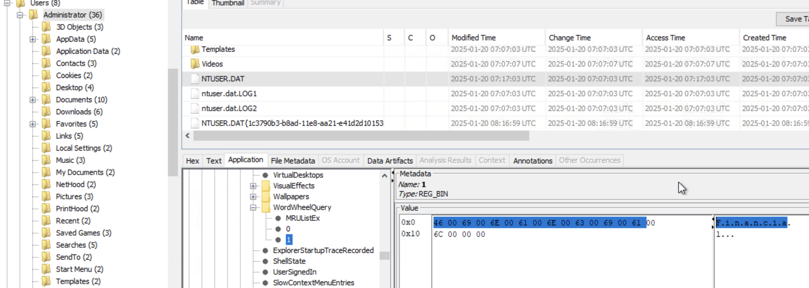

### What are the names of the folders that were present on the USB device? (alphabetical order)

Since we are looking for folders, we assume that Liam browsed to those folders and we check if shell bags will provide us with an answer. *Autopsy Shell Bags* are crucial forensic artifacts within the Windows Registry, stored in `NTUSER.DAT` and `USRCLASS.DAT`, that track user folder access (browsing, creating, deleting) to reveal file system activity, even for deleted items, showing folder view settings (size, location) and activity patterns. With that being said, Looking at the shell bags we see 2 interesting folders: **Critical Data TECH THM** and **Exfiltration Plan**.

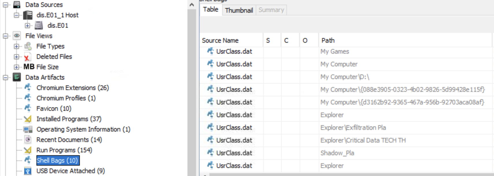

### The external entity didn't fully trust Liam for the exfiltration so they asked him to execute file_uploader.exe, through the instructions in PDF. When was this file last executed and how many times was it executed? (YYYY-MM-DD HH:MM:SS, number of execution times)

The best way to go about this is by examining *Prefetch*. `.pf` files (located in `C:\Windows\Prefetch`) are created by Windows to speed up app launches, serving as crucial forensic evidence to show what, when, and how often programs (including malware) were run, even if deleted, by tracking execution details like timestamps, run counts, and accessed files, helping build timelines and prove activity. 

So we start by dumping and extracting the files inside the `Prefetch` folder. We're interested in the file called `FILE_UPLOADER.EXE-FCDB89C7.pf`. Using *PEcmd* to analyze said `.pf` file we see that the executable last ran on **22025-01-29 11:26:09** and that it was ran **twice** by Liam.

### Liam received a hidden flag inside a file (in the zip folder) from the external entity helping him. What was that?

Going back to the content of `.zip` file received by Liam from teh external entity, specifically the file `confidential`. We can use *ExifTool* to examine the file's metadata which contains our flag under the `comment` attribute.

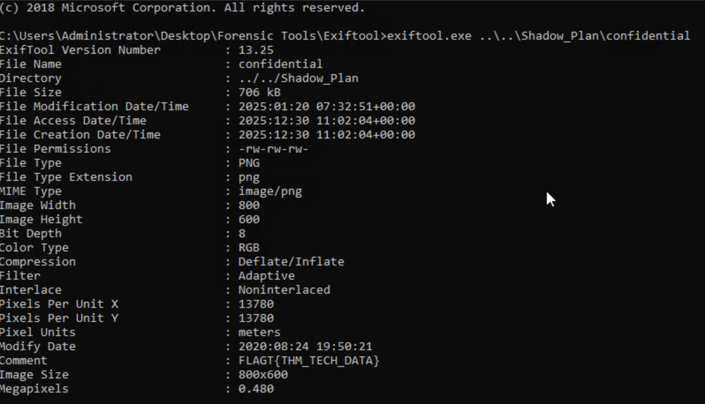

### It seems like Liam caused one last damage before leaving. When did Liam delete "Tax Records.docx"? (YYYY-MM-DD HH:MM:SS)

We start in *Autopsy* by dumping `$UsnJrnl` which is a hidden system file at the root of each NTFS volume specifically under the `$Extend` directory. This file records all file and directory changes on a volume, including creation, modification, deletion, and renaming events.

Now we can rely on *MFTECmd* to analyze the `$UsnJrnl` file. 

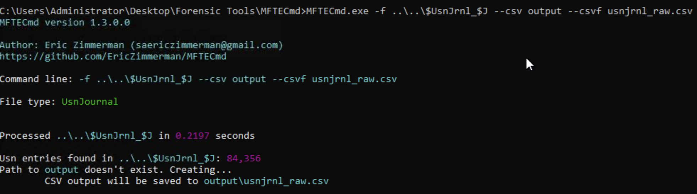

Then we import the generated file `usnjrnl_raw.csv` into *TimelineExplorer* to visualize and filter file system changes by MACB times, reason codes, and file names. Thus getting the deletion time for the file `Tax Records.docx`.

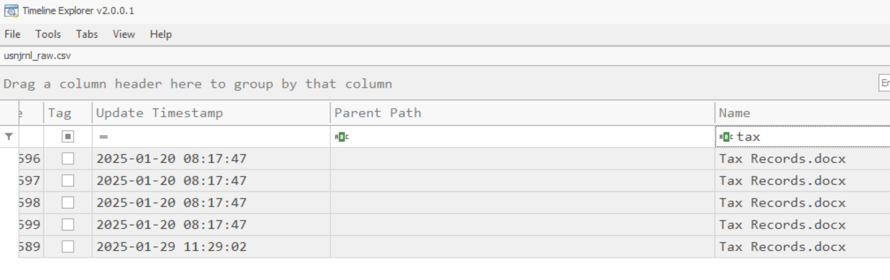

### Which social media site did Liam search for using his web browser? Likely to avoid suspicion, thinking somebody was watching him. (Full URL)

This is easily found using *Autopsy* under *Web History*, it's **https://www.facebook.com/**

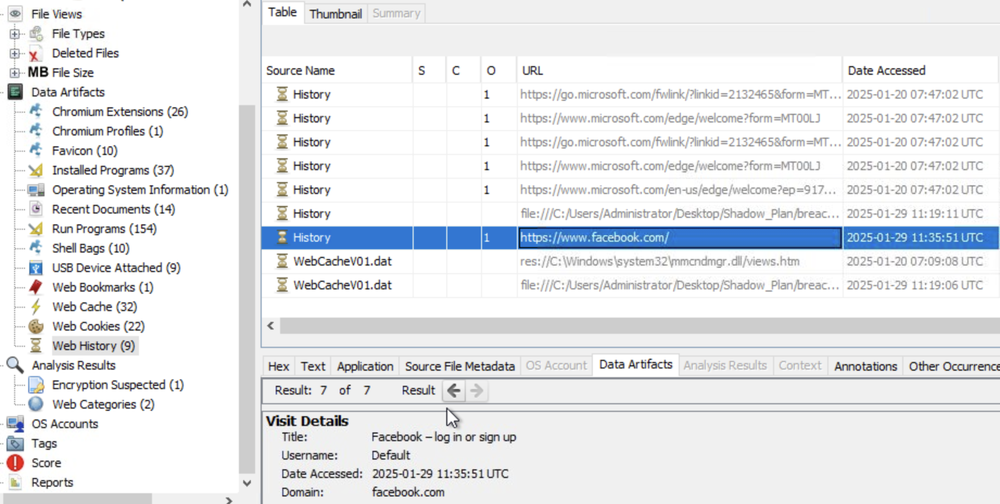

### What is the PowerShell command Liam executed as per the plan?

We can find powershell's history under `%AppData%\Microsoft\Windows\PowerShell\PSReadLine\ConsoleHost_history.txt`.

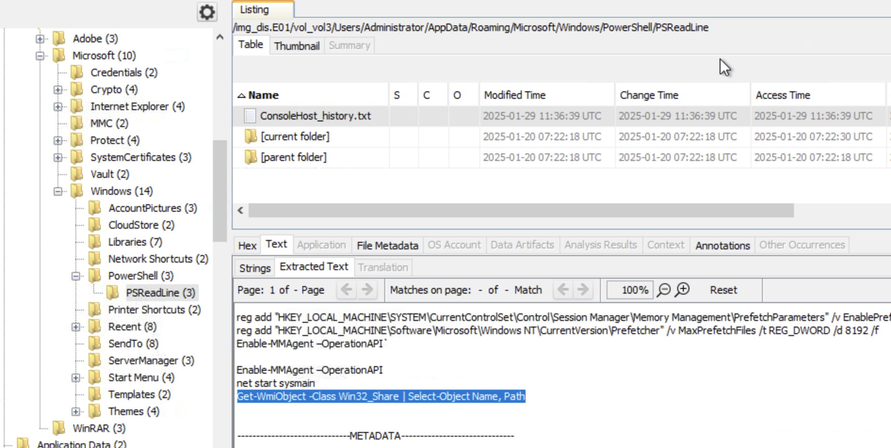

The command executed by Liam as per the external entity's plan is: `Get-WmiObject -Class Win32_Share | Select-Object Name, Path`

# Observations

A disk image is a tresure trove full of data, but only if you know where to look 😊